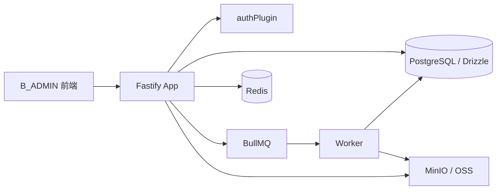
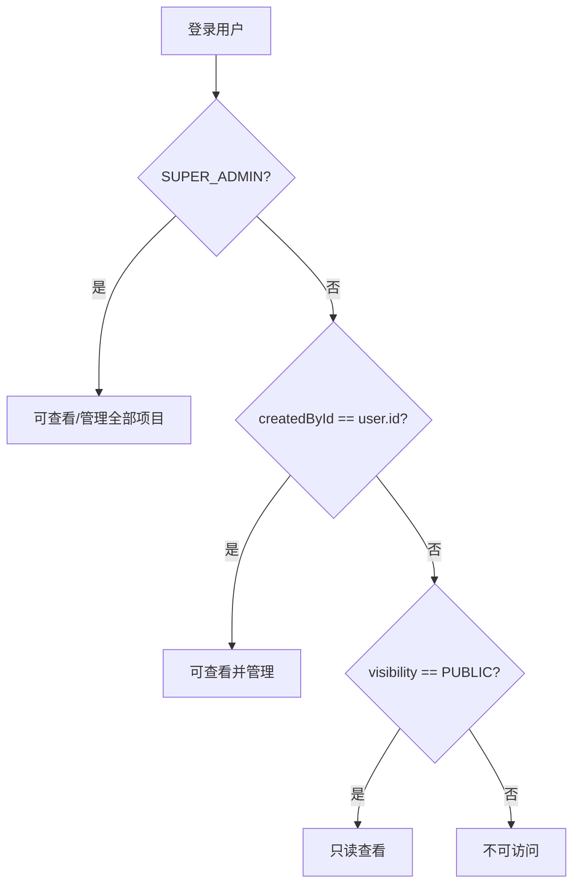

# 后端契约说明

本文档只依据 `../backend` 已实现代码整理，不包含前端自行推测的接口。

## 1. 后端总体架构

后端是 Fastify + TypeScript + Zod + Drizzle 的模块化单体服务，运行入口在 `src/app.ts`。



已注册的核心路由边界：

| 边界 | 前缀 | 客户端 | 说明 |
| --- | --- | --- | --- |
| 认证 | `/api/v1/auth` | `B_ADMIN` / `C_APP` / `PC_AI` | B 端验证码登录、客户端登录、刷新、退出、当前用户、动态路由 |
| 公共字典 | `/api/v1/dicts` | 匿名 | 固定基础枚举 |
| B 端权限 | `/api/v1/permissions/me` | `B_ADMIN` | 当前账号 RBAC 权限摘要 |
| 共用项目 | `/api/v1/projects/*` | 登录用户 | 创建、公开项目、项目详情 |
| B 端工作台项目 | `/api/v1/workspace/projects/*` | `B_ADMIN` | 我的项目、项目变更 |
| B 端平台项目 | `/api/v1/platform/projects/*` | `B_ADMIN` | 平台项目列表与统计 |
| 用户管理 | `/api/v1/platform/users/*` | `B_ADMIN` | 用户 CRUD、导入导出、岗位/部门分配 |
| 菜单/角色/部门/字典 | `/api/v1/platform/*` | `B_ADMIN` | 系统管理与平台运维拆分实现 |
| AI 配置 | `/api/v1/platform/ai/*` | `B_ADMIN` | 服务商、模型、场景、提示词 |
| AI 运营 | `/api/v1/platform/ai/*` | `B_ADMIN` | 会话运营详情、反馈列表 |
| AI 对话 | `/api/v1/ai/*` | 登录用户 | 会话、消息、SSE、停止、反馈、重新生成、报告草稿 |
| 文件 | `/api/v1/files/*` | 登录用户 | 预签名上传、状态、下载、删除 |
| 报告 | `/api/v1/reports/*` | 登录用户 | 创建、生成、发布、下载、删除 |
| 分享 | `/api/v1/shares/*` | 登录用户 | 创建、禁用分享 |
| 公开分享 | `/api/v1/public/shares/*` | 匿名 | 公开快照访问 |
| 审计与运维 | `/api/v1/platform/*` | `B_ADMIN` | 审计、登录日志、在线用户、缓存、任务 |

## 2. 认证方式

### B 端登录

B 端必须使用 `B_ADMIN` Token。

| 能力 | 方法 | 路径 | 说明 |
| --- | --- | --- | --- |
| 获取验证码 | `GET` | `/api/v1/auth/b/captchaImage` | 返回 `uuid`、`image/img`、`expiresIn` |
| B 端登录 | `POST` | `/api/v1/auth/b/login` | 入参 `identifier`、`password`、`captchaUuid`、`captchaCode`；普通用户禁止登录 B 端 |
| 获取当前 B 端用户 | `GET` | `/api/v1/auth/b/getInfo` | 返回 `user`、`departments`、`permissions`、`roles`、`dataScopes` |
| 获取动态路由 | `GET` | `/api/v1/auth/b/getRouters` | 返回 `routers` 与 `permissions` |
| 刷新 Token | `POST` | `/api/v1/auth/refresh` | 入参 `refreshToken`；刷新令牌轮换 |
| 退出登录 | `POST` | `/api/v1/auth/logout` | 入参 `refreshToken`；撤销 refresh token |
| 当前登录用户 | `GET` | `/api/v1/auth/me` | 登录用户通用 |

Token 规则：

- access token JWT payload 包含 `sub`、`tokenType: access`、`clientType`、`jti`。
- `B_ADMIN` access token 默认有效期 24h，refresh token 默认 30 天。
- `/api/v1/platform/*` 和 `/api/v1/workspace/*` 在认证插件中强制 `clientType === B_ADMIN`。
- access token 支持黑名单：强制下线会将 `jti` 写入 Redis。
- 前端必须保存 `accessToken` 与 `refreshToken`；刷新成功后同时替换。

## 3. 响应结构

成功：

```json
{
  "success": true,
  "data": {},
  "requestId": "..."
}
```

失败：

```json
{
  "success": false,
  "error": {
    "code": 401,
    "message": "登录状态无效或已过期"
  },
  "requestId": "..."
}
```

前端约束：

- HTTP 200 不代表业务成功，必须判断 `success === true`。
- 业务错误也可能 HTTP 200；`error.code` 使用数值型 HTTP 语义码。
- 未捕获服务端异常返回 HTTP 500，仍可能带 `{ success: false, error }`。
- 401 必须走单次刷新与请求队列；刷新失败后清理 B 端登录态。

## 4. 权限规则

固定业务身份：

| 身份 | 含义 | B 端登录 | 项目创建 | 项目管理 |
| --- | --- | --- | --- | --- |
| `SUPER_ADMIN` | 超级管理员 | 允许 | 允许 | 可管理所有项目 |
| `CHANNEL_USER` | 渠道用户 | 允许 | 允许 | 只能管理自己创建的项目 |
| `NORMAL_USER` | 普通用户 | 禁止 | 第一期禁止 | 仅可读取公开项目 |

渠道类型：

- `channelType` 仅用于区分渠道用户标签：`DEALER`、`SALESPERSON`。
- 不允许把 `channelType` 当成动态 RBAC 角色。

动态 RBAC：

- 菜单、页面和按钮由 `roles`、`permissions`、`menus` 控制。
- 超级管理员拥有全部权限。
- 非超级管理员只使用启用角色授予的权限。
- 禁用角色不会继续授予权限。
- 后台接口必须使用精确权限码，不能用任意 `system:*` 放行。

种子权限中已出现的关键权限码：

| 模块 | 权限码 |
| --- | --- |
| 项目 | `project.create`、`project.read_public`、`system:project:list` |
| 用户 | `system:user:list/add/edit/remove/export/import/reset-password/post/dept/role` |
| 角色 | `system:role:list/add/edit/remove/export/permission/data-scope` |
| 菜单/权限 | `system:menu:list/add/edit/remove`、`system:permission:list/add` |
| 部门/岗位 | `system:dept:list/add/edit/remove`、`system:post:list/add/edit/remove` |
| 字典 | `system:dict:list/add/edit/remove`、`system:dict:item:add` |
| AI 配置 | `system:ai:provider:*`、`system:ai:model:*`、`system:ai:scene:*`、`system:ai:prompt:*` |
| AI 运营 | `system:ai:conversation:list/detail`、`system:ai:feedback:list` |
| 监控 | `monitor:audit:*`、`monitor:login-log:list`、`monitor:online:*`、`monitor:cache:*`、`monitor:job:*` |

## 5. 项目可见性

项目权限由 `src/shared/permissions.ts` 控制，独立于后台 RBAC。



规则：

- 私有项目：只有创建者和超级管理员可访问。
- 公开项目：所有登录用户可只读查看。
- 公开项目不开放源文件、知识库原文、原始 AI 会话和未发布报告。
- 项目创建者与超级管理员可以修改项目、切换可见性、删除项目、上传源文件、生成/发布/删除报告、创建项目分享。
- `ProjectMember` 只是扩展点，第一期没有协作接口。

## 6. 后端模块和接口分类

本节表格为便于阅读，平台、工作台和共用业务接口省略统一前缀 `/api/v1`；完整路径以第 1 节路由边界和各页面文档为准。

### 6.1 用户与系统管理

| 模块 | 接口 |
| --- | --- |
| 用户管理 | `GET /platform/users`、`GET /platform/users/export`、`POST /platform/users/import`、`POST /platform/users`、`GET/PATCH/DELETE /platform/users/:id`、`PATCH /platform/users/:id/status`、`POST /platform/users/:id/restore`、`POST /platform/users/:id/reset-password`、`PUT /platform/users/:id/posts`、`PUT /platform/users/:id/departments` |
| 角色权限 | `GET/POST /platform/roles`、`PATCH/DELETE /platform/roles/:id`、`PATCH /platform/roles/:id/status`、`GET /platform/roles/export`、`PUT /platform/roles/:id/permissions`、`PUT /platform/roles/:id/departments`、`GET /platform/roles/:id/users`、`GET/POST /platform/permissions`、`PUT /platform/users/:id/roles` |
| 菜单管理 | `GET/POST /platform/menus`、`PATCH/DELETE /platform/menus/:id` |
| 部门管理 | `GET/POST /platform/departments`、`GET /platform/departments/tree`、`PATCH/DELETE /platform/departments/:id`、`PATCH /platform/departments/:id/status` |
| 岗位管理 | `GET/POST /platform/posts`、`PATCH/DELETE /platform/posts/:id`、`PATCH /platform/posts/:id/status` |
| 字典管理 | `GET/POST /platform/dictionaries`、`PATCH/DELETE /platform/dictionaries/:id`、`GET/POST /platform/dictionaries/:id/items`、`PATCH/DELETE /platform/dictionaries/:id/items/:itemId` |

### 6.2 项目

| 边界 | 接口 | 权限 |
| --- | --- | --- |
| 工作台 | `POST /workspace/projects` | `project.create` + 项目创建规则 |
| 工作台 | `GET /workspace/projects/my` | 登录 B 端用户 |
| 工作台 | `PATCH /workspace/projects/:id` | 项目创建者或超级管理员 |
| 工作台 | `PATCH /workspace/projects/:id/visibility` | 项目创建者或超级管理员 |
| 工作台 | `DELETE /workspace/projects/:id` | 项目创建者或超级管理员 |
| 共用 | `POST /projects` | B 端需 `project.create`；仍按项目创建规则 |
| 共用 | `GET /projects/public` | 登录用户 |
| 共用 | `GET /projects/:id` | `canViewProject` |
| 平台 | `GET /platform/projects/statistics` | `system:project:list` |
| 平台 | `GET /platform/projects` | `system:project:list` |

### 6.3 AI 配置和 AI 运营

| 模块 | 接口 | 权限 |
| --- | --- | --- |
| 服务商 | `GET/POST /platform/ai/providers`、`PATCH/DELETE /platform/ai/providers/:id` | `system:ai:provider:list/add/edit/remove` |
| 模型 | `GET/POST /platform/ai/models`、`PATCH/DELETE /platform/ai/models/:id`、`POST /platform/ai/models/:id/test-connection` | `system:ai:model:list/add/edit/remove/test` |
| 场景绑定 | `GET /platform/ai/scene-bindings`、`PUT /platform/ai/scene-bindings` | `system:ai:scene:list/edit` |
| 提示词 | `GET/POST /platform/ai/prompts`、`DELETE /platform/ai/prompts/:id` | `system:ai:prompt:list/add/remove` |
| AI 会话运营 | `GET /platform/ai/conversations`、`GET /platform/ai/conversations/:id` | `system:ai:conversation:list/detail` |
| AI 反馈 | `GET /platform/ai/feedbacks` | `system:ai:feedback:list` |

### 6.4 AI 对话

| 接口 | 说明 |
| --- | --- |
| `POST /api/v1/ai/conversations` | 创建会话；`clientApp` 必须匹配当前 token 来源；报告生成场景需可管理项目 |
| `GET /api/v1/ai/conversations` | 我的会话分页、搜索、项目筛选、来源筛选、置顶、含删除筛选 |
| `GET /api/v1/ai/conversations/:id` | 会话详情，返回消息、检索、反馈、重新生成记录、报告和分享 |
| `PATCH /api/v1/ai/conversations/:id` | 重命名 |
| `PUT /api/v1/ai/conversations/:id/pin` | 置顶/取消置顶 |
| `PATCH /api/v1/ai/conversations/:id/project` | 移动到可管理项目 |
| `DELETE /api/v1/ai/conversations/:id` | 软删除；会禁用关联 AI 分享 |
| `POST /api/v1/ai/conversations/:id/restore` | 恢复软删除会话 |
| `PATCH /api/v1/ai/conversations/:id/settings` | 修改会话级 `reasoningMode` |
| `POST /api/v1/ai/conversations/:id/messages` | SSE 发送消息并接收回答 |
| `POST /api/v1/ai/messages/:id/stop` | 停止生成 |
| `PUT /api/v1/ai/messages/:id/feedback` | 点赞/点踩/标签/文本反馈 |
| `POST /api/v1/ai/messages/:id/regenerate` | SSE 重新生成 |
| `POST /api/v1/ai/conversations/:id/report-draft` | 生成结构化报告草稿 |

## 7. AI 流式通信

SSE 接口：

- `POST /api/v1/ai/conversations/:id/messages`
- `POST /api/v1/ai/messages/:id/regenerate`

前端必须使用 `fetch + AbortController`，不能用普通 Axios JSON 请求。

事件：

| event | data | 含义 |
| --- | --- | --- |
| `message` | `{ messageId, conversationId, originalMessageId? }` | 服务端已创建助手消息 |
| `progress` | `{ stage, message }` | 阶段提示，`stage` 为 `analyzing/checking/composing/completed` |
| `delta` | `{ text }` | 增量文本 |
| `done` | `{ messageId, usage, sources }` | 正常完成 |
| `stopped` | `{ messageId, content }` | 已停止，并保存已生成内容 |
| `error` | `{ code, message }` | 生成失败 |

停止规则：

- 停止只结束当前生成，不删除会话。
- 服务端保存已生成内容并标记消息 `STOPPED`。
- 会话仍可继续发送新消息。

## 8. 文件、报告和分享规则

### 文件

- 支持 MIME：PDF、DOCX、PNG、JPEG。
- 上传流程：`upload-intents` 创建记录和预签名 URL → 客户端直传对象存储 → `complete` 校验大小、SHA-256 和真实 MIME → 投递文档解析队列。
- 源文件访问：只有超级管理员或文件所有者可访问，公开项目不会开放源文件。
- 文件状态：`UPLOADING`、`QUEUED`、`PARSING`、`OCR_REQUIRED`、`INDEXING`、`READY`、`FAILED`、`DELETED`。

### 报告

- 报告必须绑定项目。
- 创建、生成、发布、删除报告必须可管理项目。
- 读取报告使用 `canViewProject`；非管理者只能读取已发布报告。
- 报告产物类型：`HTML`、`IMAGE`、`WORD`、`PDF`。
- 多条 AI 回答生成报告时，`report_sources` 保存来源顺序和回答快照。

### 分享

- 登录用户可创建分享，匿名用户只能访问公开分享快照。
- 分享目标：`AI_MESSAGES`、`REPORT`、`REPORT_ARTIFACT`、`PROJECT`。
- `PROJECT` 分享只包含项目摘要和已发布报告快照。
- 公开分享不得暴露源文件、知识库原文、未发布报告、原始会话或后台权限信息。
- 分享支持禁用、过期时间、最大访问次数和访问记录。