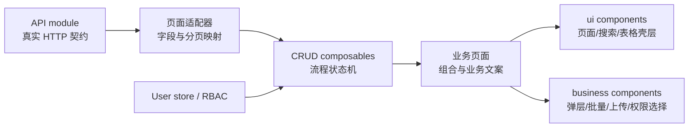
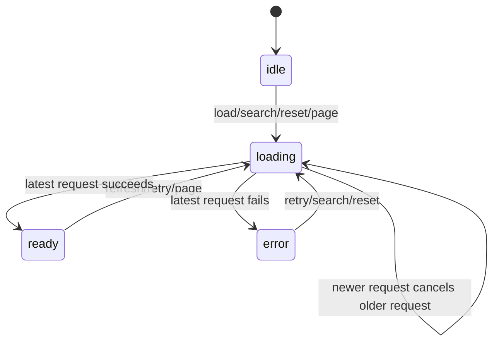

# 通用 CRUD 基础设施

本文档说明后台业务页面如何组合现有 UI 壳层与通用 CRUD 能力。基础设施不包含具体业务接口、字段或静态业务数据。

## 1. 职责边界



- `src/api/modules/**`：只描述已存在的后端网络契约。
- 页面适配器：把真实接口入参与响应映射为通用 CRUD 契约；不得在组件内做字段兼容。
- `src/composables/**`：管理查询、分页、并发请求、选择、弹层、提交、确认和导出状态。
- `src/components/ui/**`：提供业务无关的页面、筛选和表格壳层。
- `src/components/business/**`：提供可复用的后台交互组合，不读取具体业务 store 或 API。
- 业务页面：注入业务文案、字段、权限码和真实 API 适配器，只负责组合。

## 2. 列表与表格

### `useCrudList`

`useCrudList<TItem, TQuery>` 统一管理：

- 查询模型；
- 当前页、每页条数和总数；
- `idle | loading | ready | error` 状态；
- 搜索重置到第一页；
- 重置查询；
- 最新请求优先和旧请求取消；
- 当前选择、跨页保留选择和已选择行；
- `AppDataTable` 可直接消费的 `tableStatus`。

调用方必须注入：

- `createQuery`：每次返回全新的初始查询对象；
- `fetcher`：调用真实 API，并返回 `PageResult<TItem>`；
- `rowKey`：解析为 `string | number` 的稳定主键。

`fetcher` 会收到 `AbortSignal`。API 模块使用 Axios 时应把它传入请求配置，确保旧请求能够真正取消。

```ts
const list = useCrudList<Row, Query>({
  createQuery: () => ({ keyword: '', status: undefined }),
  rowKey: 'id',
  reserveSelection: true,
  fetcher: ({ query, page, pageSize, signal }) => props.fetchPage({
    ...query,
    page,
    pageSize,
  }, signal),
})
```

### `AppDataTable`

`AppDataTable` 继续承担加载、错误、空态、分页、列设置、刷新和全屏。新增受控选择协议：

- `rowSelectionType="multiple" | "single"` 开启选择；
- `selectedRowKeys` 由 composable 管理；
- `selection-change` 回传主键和已选择行；
- `reserveSelectedRowOnPaginate` 控制 TDesign 跨页表现；
- 选择列由组件自动注入，业务页面不得再声明第二个选择列。

```vue
<AppDataTable
  :columns="columns"
  :current="list.current.value"
  :data="list.data.value"
  :page-size="list.pageSize.value"
  row-key="id"
  row-selection-type="multiple"
  :selected-row-keys="list.selectedRowKeys.value"
  :status="list.tableStatus.value"
  :total="list.total.value"
  @page-change="list.changePage"
  @refresh="list.refresh"
  @retry="list.retry"
  @selection-change="list.changeSelection"
/>
```

## 3. 表单弹层

### `useCrudDrawer`

弹层状态使用 `create | edit | view` 判别联合。调用方必须显式提供：

- `createForm()`：创建模式的初始表单；
- `editForm(entity)`：实体到表单 DTO 的单向映射；
- `submit(context)`：创建或编辑的真实提交适配器。

实体 DTO 与表单 DTO 必须分离，避免把表格行对象直接双向绑定到表单。提交失败时保留表单和弹层，允许用户修正后重试；提交期间禁止关闭。

状态机与容器无关：`useCrudDrawer` 同时驱动 `AppCrudFormDialog` 和 `AppCrudFormDrawer`。

### `AppCrudFormDialog`（默认）

新增/编辑表单默认使用 Dialog 形态（居中弹窗）。组件只负责 TDesign Dialog/Form、校验、只读模式和提交意图，不执行保存请求。推荐组合：

```vue
<AppCrudFormDialog
  :form-data="drawer.formData"
  :mode="drawer.mode.value"
  :rules="rules"
  :submitting="drawer.isSubmitting.value"
  :visible="drawer.visible.value"
  :width="'min(760px, 92vw)'"
  @submit="drawer.submit"
  @update:visible="drawer.setVisible"
>
  <template #default="{ data, readonly }">
    <!-- 业务字段由页面提供；readonly 传给需要单独控制的复杂字段 -->
  </template>
</AppCrudFormDialog>
```

- `width` 默认 `min(640px, 92vw)`，两列表单场景可显式放大。
- `columns="2"` 时表单呈两列布局，窄屏自动回退单列。
- 新增/编辑表单默认两列（`columns="2"`）；需要占满整行的表单项（树选择、textarea 等）使用全局类 `vicp-form-grid-item--wide`。
- label 统一上下对齐（`label-align="top"`），不做左右布局。
- 校验错误消息由容器组件统一处理间距，页面不得覆盖。

### `AppCrudFormDrawer`（侧滑形态）

需要更多垂直空间或侧边上下文的长表单时使用 Drawer（右侧滑出）。props/事件契约与 `AppCrudFormDialog` 一致，仅尺寸属性不同：Drawer 用 `size`（默认 `min(640px, 92vw)`），Dialog 用 `width`。

```vue
<AppCrudFormDrawer
  :form-data="drawer.formData"
  :mode="drawer.mode.value"
  :rules="rules"
  :submitting="drawer.isSubmitting.value"
  :visible="drawer.visible.value"
  @submit="drawer.submit"
  @update:visible="drawer.setVisible"
>
  <template #default="{ data, readonly }">
    <!-- 业务字段由页面提供；readonly 传给需要单独控制的复杂字段 -->
  </template>
</AppCrudFormDrawer>
```

保存成功后的刷新通过 `onSuccess` 连接，不由弹层组件隐式触发：

```ts
const drawer = useCrudDrawer({
  createForm,
  editForm,
  submit: saveAdapter,
  onSuccess: () => list.refresh(),
})
```

## 4. 删除与批量操作

- `useCrudDelete`：单行删除确认和运行锁。
- `useCrudBatchAction`：以只读主键数组执行批量动作。
- `AppCrudBatchBar`：展示选择数量和批量动作插槽，`clear` 交给列表状态处理。

确认标题、内容和成功文案必须由业务页面注入。确认取消不会执行动作；动作失败沿用 `confirmAndRun` 的统一错误反馈并保持确认框可重试。

```ts
const deletion = useCrudDelete({
  action: removeAdapter,
  confirm: row => ({
    title: '确认删除',
    content: `删除“${row.name}”后无法恢复，是否继续？`,
    danger: true,
  }),
  successMessage: '删除成功',
  onSuccess: () => list.refresh(),
})

const batch = useCrudBatchAction({
  action: batchAdapter,
  confirm: keys => ({
    title: '确认批量操作',
    content: `将处理已选择的 ${keys.length} 项，是否继续？`,
  }),
  onSuccess: () => {
    list.clearSelection()
    return list.refresh()
  },
})
```

## 5. 导入、上传与导出

### `AppImportUpload`

组件使用 TDesign Upload，但不接收或推导上传 URL。调用方注入 `CrudUploadHandler`，负责：

- 调用真实上传或导入 API；
- 传递认证信息；
- 消费 `AbortSignal`；
- 通过 `onProgress` 上报真实进度；
- 返回接口结果。

组件负责文件列表、校验展示、进度投影、取消和 `success/error/progress` 事件。不得用 `action` 指向未经确认的地址，也不得用定时器伪造正式上传结果。

```vue
<AppImportUpload
  accept=".xlsx,.csv"
  :handler="importAdapter"
  :size-limit="{ size: 10, unit: 'MB' }"
  tips="仅支持接口已声明的导入格式"
  @success="handleImportSuccess"
/>
```

### `useCrudExport`

`useCrudExport` 管理运行锁、进度、取消、成功和失败状态。它不决定导出请求参数，也不创建下载链接；文件响应解析和浏览器下载仍由真实 API 适配器负责。

```ts
const exporter = useCrudExport({
  handler: ({ signal, onProgress }) => exportAdapter({ signal, onProgress }),
  successMessage: '导出任务已完成',
})
```

## 6. 权限

### 操作可见性

`usePermissionAccess` 连接当前用户 store，供配置驱动的按钮或菜单使用：

```ts
const { filterPermitted } = usePermissionAccess()

const visibleActions = computed(() => filterPermitted([
  { id: 'edit', permissions: ['system:example:edit'] },
  { id: 'remove', permissions: ['system:example:remove'] },
  {
    id: 'compound',
    permissions: ['system:example:read', 'system:example:edit'],
    permissionMatch: 'all',
  },
]))
```

已有 `v-permission` 仍适合少量静态按钮。配置驱动动作优先使用 `usePermissionAccess`，避免在模板中散落多组判断。前端权限只控制可见性，后端仍是最终授权边界。

### `AppPermissionSelector`

组件接收调用方提供的权限树 `CrudPermissionOption[]`，支持搜索、全选、清空、禁用节点和严格/级联选择。组件不请求权限列表、不保存角色权限，也不假设权限码格式。

## 7. 状态约束



- 页面只能通过 composable 的动作改变分页和流程状态。
- 查询输入可直接绑定 `query`，但网络请求只由 `search/reset/changePage/refresh` 触发。
- 只有最新列表请求可以提交结果，过期请求不得覆盖新数据。
- mutation 运行期间必须禁用重复提交和关闭入口。
- 业务成功后是否刷新、清空选择或关闭，由页面通过回调显式连接。

## 8. 主题与响应式

- 新增组件只使用 `--td-*` 和既有 `--vicp-*` token，不维护独立主题状态。
- 弹层默认宽度为 `min(640px, 92vw)`，移动端不会超出视口。
- 批量操作栏与权限选择工具栏在窄屏自动换行。
- 页面不要覆盖组件内部颜色来表达业务状态；状态语义继续使用统一状态组件和 TDesign theme。