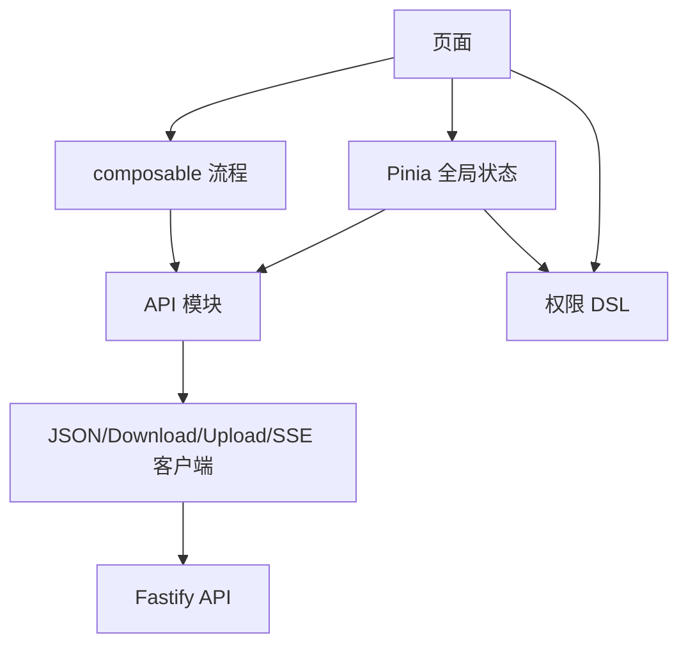
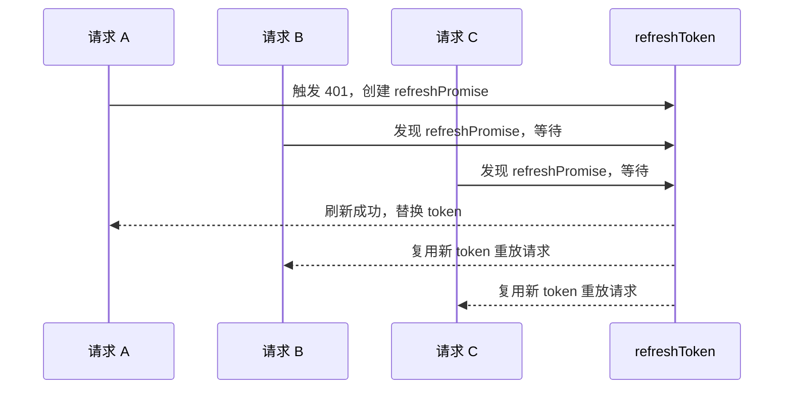
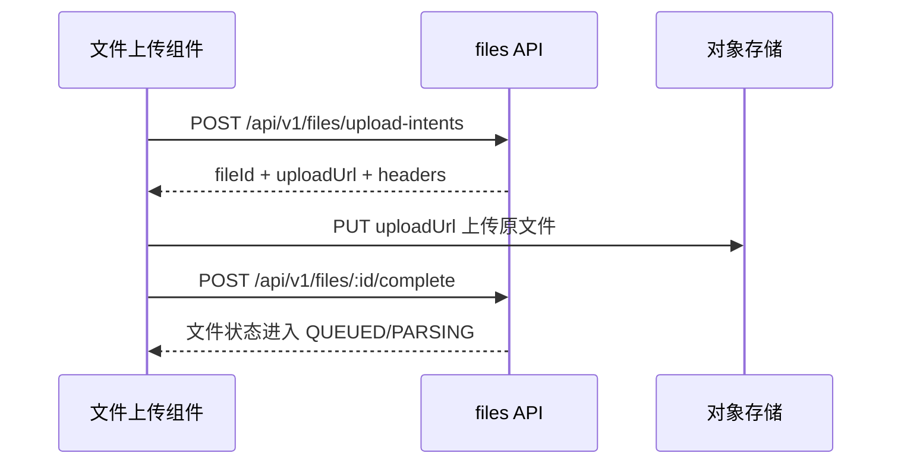
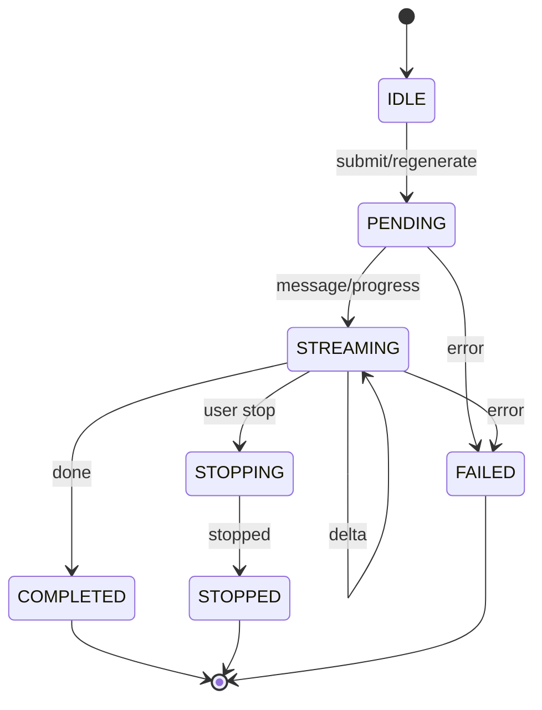
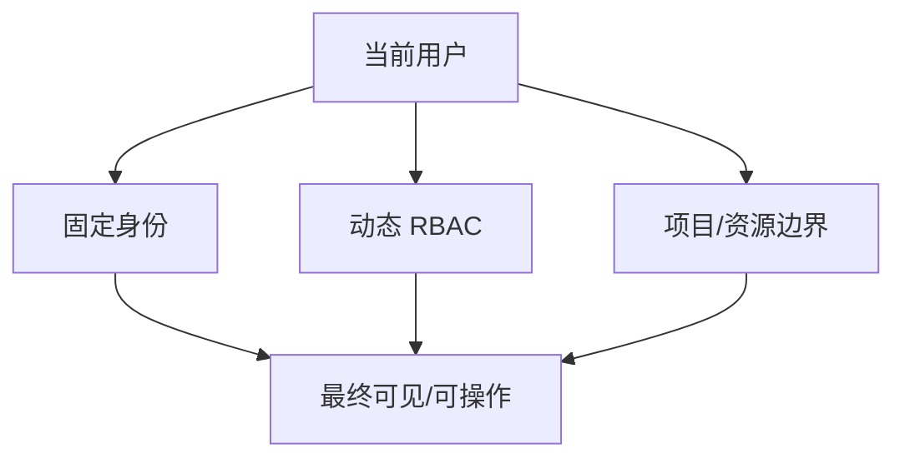
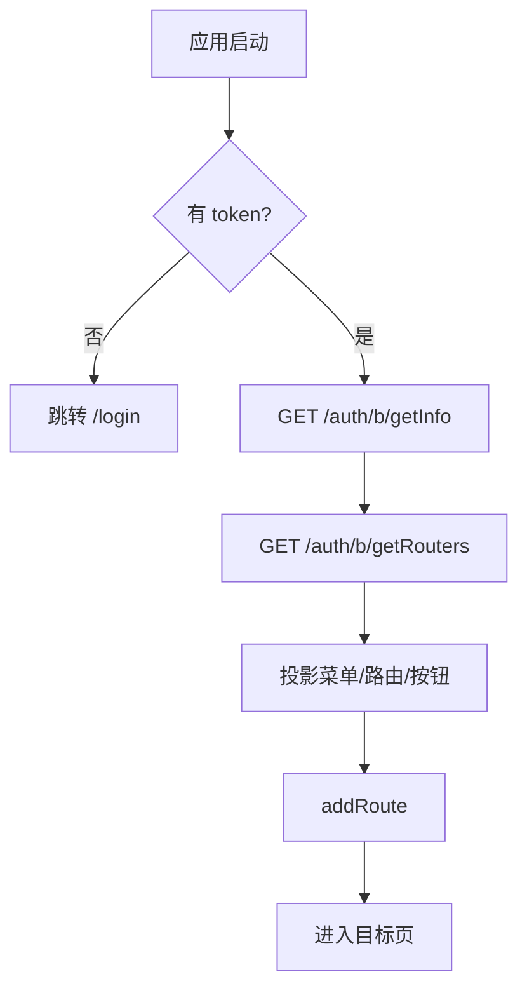

# 前端架构实施方案

本文档定义 `admin-web` 后续实现阶段的目录职责、数据流、权限模型、请求封装、SSE、主题和工程闸门。当前阶段只写设计，不创建业务页面。

## 1. 架构目标

管理后台是 `B_ADMIN` 客户端，不是 PC AI 端和 C 端 App 的复用壳。

核心目标：

- 认证、权限、菜单、项目边界在前端模型上分层，不混成一个 `role` 判断。
- 后端接口以真实 OpenAPI 和已实现路由为准，不通过 Mock 或前端假数据掩盖契约缺口。
- JSON API、下载、预签名上传、SSE 分别封装，避免一个 Axios 实例承担全部协议复杂度。
- 路由和菜单由后端动态菜单驱动，但组件加载只走本地白名单。
- UI 采用中深蓝视觉体系，主题 token 化，优先复用 TDesign Vue Next。

## 2. 推荐目录职责

```text
src/
├─ api/                         后端接口模块，只表达网络契约
│  ├─ http/                     Axios、刷新锁、错误映射、下载
│  ├─ modules/                  按后端模块拆分 API
│  ├─ sse/                      AI 流式 fetch 解析
│  └─ generated/                OpenAPI 生成类型，不手改
├─ router/                      静态基础路由、动态路由投影、守卫
│  ├─ guards/                   登录、权限、标题、标签页
│  └─ component-map.ts          后端 component key 到本地组件白名单
├─ layouts/                     后台主布局、登录布局、空布局
├─ stores/                      Pinia 状态
│  ├─ auth.ts                   token、刷新、退出
│  ├─ user.ts                   当前用户、角色、权限、数据范围
│  ├─ route.ts                  动态菜单、路由缓存
│  ├─ app.ts                    布局、侧栏、标签页
│  └─ settings.ts               主题与偏好
├─ permissions/                 权限判断 DSL
│  ├─ rbac.ts                   菜单/按钮权限
│  ├─ project.ts                项目可见性与可管理判断
│  └─ directives.ts             v-permission 指令
├─ composables/                 可组合业务状态
│  ├─ useTableQuery.ts          表格查询、分页、筛选
│  ├─ useAsyncTask.ts           轮询任务状态
│  ├─ useUploadIntent.ts        预签名上传流程
│  └─ useAiStream.ts            AI SSE 状态机
├─ views/                       页面，按 15 个业务模块分组
├─ components/                  跨页面复用组件
│  ├─ business/                 项目选择器、权限树、文件上传等
│  └─ ui/                       布局级 UI 小组件
├─ types/                       前端领域类型和后端生成类型适配
├─ styles/                      token、主题、布局、TDesign 覆盖
└─ tests/                       单元测试、集成测试、契约测试
```

职责约束：

- `api/modules/*` 只做接口声明和字段轻量适配，不写页面状态。
- `stores/*` 管全局状态，不承接单页表格查询状态。
- `composables/*` 管可复用流程，例如上传、轮询、SSE、表格查询。
- `permissions/*` 独立表达权限规则，页面不直接散落复杂 `if role === ...`。
- `views/*` 只编排页面，复杂动作下沉到 composable 或 store。

## 3. 数据流分层



关键规则：

- 页面只关心“展示态”和“用户动作”。
- API 模块只关心“请求入参”和“响应出参”。
- 权限 DSL 只关心“当前用户 + 目标资源 + 动作”。
- 项目、文件、报告、分享和 AI 会话必须经过“RBAC + 项目规则/归属规则”两道门。

## 4. OpenAPI 类型链路

后端 Swagger 已提供 OpenAPI 能力，前端实现阶段建议引入生成链路：

```text
Fastify Swagger
  -> openapi.json
  -> openapi-typescript
  -> src/api/generated/schema.ts
  -> src/api/modules/*.ts
```

建议脚本：

```json
{
  "scripts": {
    "api:schema": "openapi-typescript http://localhost:3000/docs/json -o src/api/generated/schema.ts"
  }
}
```

说明：

- 生成文件只作为类型来源，不直接在页面使用。
- API 模块负责把后端字段适配为前端更稳定的领域类型。
- 如果 OpenAPI 缺少 schema 或 tag 不准确，记录到 `api-gaps.md`，不在页面层硬猜。

## 5. 请求封装

### 5.1 JSON API

统一响应结构：

```ts
type ApiSuccess<T> = {
  success: true;
  data: T;
  requestId: string;
};

type ApiFailure = {
  success: false;
  error: {
    code: number;
    message: string;
  };
  requestId: string;
};
```

Axios 封装职责：

- 注入 `Authorization: Bearer <accessToken>`。
- 注入客户端上下文，前端只接受 `B_ADMIN` 登录态。
- 判断 `success === true` 后再返回 `data`。
- 统一处理业务错误和 HTTP 错误。
- 对 `401` 进入刷新锁。
- 保留 `requestId` 便于错误追踪。

### 5.2 401 刷新锁

必须保证同一时间只有一个 refresh 请求。



失败处理：

- refresh 成功：更新 `accessToken` 与 `refreshToken`，重放等待队列。
- refresh 失败：清空 B 端会话，跳转 `/login`。
- `error.code === 401` 与真实 HTTP 401 使用同一策略。
- 禁止多个失败请求各自刷新，避免 refresh token 轮换冲突。

### 5.3 下载响应

下载接口不能走普通 JSON `data` 解包。

适用场景：

- 用户导出。
- 角色导出。
- 审计日志导出。
- 报告产物下载 URL 获取后跳转下载。

设计：

- `downloadClient` 独立封装 `blob` 或 `arraybuffer`。
- 响应头文件名解析在 `api/http/download.ts`。
- 下载失败若返回 JSON 错误，需要反解并复用错误提示。

### 5.4 预签名上传

文件上传不能直接把文件传给后端业务接口。

流程：



前端约束：

- 上传前计算 SHA-256。
- 校验 MIME 与后端支持范围一致：PDF、DOCX、PNG、JPEG。
- 上传成功不等于解析成功，必须继续展示异步状态。
- 解析状态轮询封装在 `useAsyncTask` 或 `useFileStatus`。

## 6. AI SSE 架构

AI 流式接口只能使用 `fetch + AbortController`。

状态机：



事件处理职责：

| event | 前端动作 |
| --- | --- |
| `message` | 创建本地 assistant 消息占位，记录 `messageId` |
| `progress` | 更新阶段提示，不替代正文 |
| `delta` | 追加正文文本 |
| `done` | 标记完成，写入 usage 和 sources |
| `stopped` | 标记停止，保留服务端返回的已生成内容 |
| `error` | 标记失败，显示可追踪错误 |

实现边界：

- `AbortController.abort()` 是前端取消连接，不等价于服务端停止。
- 用户点击停止时应调用 `POST /api/v1/ai/messages/:id/stop`。
- `STOPPED` 内容是有效业务产物，不能当失败清空。
- 重新生成使用 `POST /api/v1/ai/messages/:id/regenerate`，仍是 SSE。

## 7. 权限模型

前端权限分三层。



### 7.1 固定身份

- `SUPER_ADMIN`：B 端全部业务可见，项目全量可管理。
- `CHANNEL_USER`：B 端可登录，可创建项目，只能管理自己创建的项目。
- `NORMAL_USER`：后端禁止登录 B 端。

### 7.2 动态 RBAC

来源：

- `GET /api/v1/auth/b/getInfo`
- `GET /api/v1/auth/b/getRouters`

使用：

- 菜单：由动态路由树控制。
- 页面：路由 `meta.permissions` 控制。
- 按钮：`v-permission` 或函数判断。
- 超级管理员前端可直接视为拥有全部权限，但仍不能跳过资源状态判断。

### 7.3 项目与资源边界

前端 DSL 示例：

```ts
type ProjectAction = 'read' | 'manage' | 'uploadFile' | 'generateReport' | 'share';

const canProject = (user: CurrentUser, project: ProjectSummary, action: ProjectAction) => {
  if (user.role === 'SUPER_ADMIN') return true;
  if (project.createdById === user.id) return true;
  if (action === 'read' && project.visibility === 'PUBLIC') return true;
  return false;
};
```

说明：

- 这是前端展示判断，真正安全仍以后端为准。
- 不允许只凭 `system:project:list` 判定项目详情操作权。
- 文件、报告、分享和 AI 会话都要先落到项目或资源归属判断。

## 8. 动态路由设计

启动流程：



后端菜单字段只作为数据，不作为可执行代码。

组件白名单建议：

```ts
export const componentMap = {
  Dashboard: () => import('@/views/dashboard/index.vue'),
  ProjectList: () => import('@/views/projects/list/index.vue'),
  ProjectMine: () => import('@/views/projects/my/index.vue'),
  AiConversations: () => import('@/views/ai/conversations/index.vue'),
  SystemUsers: () => import('@/views/system/users/index.vue'),
} as const;
```

路由投影规则：

- `M` 或目录：只生成菜单节点，可绑定布局或空路由。
- `C` 或页面：生成真实 route。
- `F` 或按钮：不生成 route，只进入权限集合。
- 未命中白名单的组件 key：不注册路由，记录错误并提示管理员检查菜单配置。
- 动态路由刷新时清理旧路由，避免重复注册。

## 9. 状态管理

### 9.1 `auth` store

负责：

- `accessToken`
- `refreshToken`
- 登录、刷新、退出
- token 持久化
- 清理登录态

### 9.2 `user` store

负责：

- 当前用户基础信息。
- `role`、`channelType`。
- 角色列表、权限列表、部门、岗位、数据范围。
- `isSuperAdmin`、`hasPermission` 等只读 getter。

### 9.3 `route` store

负责：

- 原始后端菜单树。
- 前端路由树。
- 侧栏菜单树。
- 按钮权限集合。
- 动态路由是否已加载。

### 9.4 `app/settings` store

负责：

- 侧栏展开状态。
- 布局模式：侧边栏、顶部、混合。
- 多标签页。
- 页面缓存 key。
- 主题模式：亮色、暗色、跟随系统。

## 10. UI 与主题

视觉定位：中深蓝、专业、低噪声、工程后台。

Token 分层：

```css
:root {
  --vicp-color-brand-1: #e8f1ff;
  --vicp-color-brand-6: #1d5fd7;
  --vicp-color-brand-8: #123f91;
  --vicp-layout-sidebar-bg: #0b1f3a;
  --vicp-layout-header-bg: #ffffff;
}
```

主题要求：

- 默认亮色主题。
- 支持暗色主题。
- 支持跟随系统。
- 所有业务图表、标签、状态色必须走 token，不在页面写散色值。
- TDesign 组件覆盖集中在 `styles/tdesign-overrides.css` 或同类文件中。

响应式断点：

| 断点 | 行为 |
| --- | --- |
| `< 768px` | 侧栏抽屉化，隐藏多标签页 |
| `768px - 1200px` | 侧栏可折叠，表格筛选折叠 |
| `> 1200px` | 完整后台布局 |

## 11. 页面缓存与标签页

规则：

- 列表页可缓存查询条件和滚动位置。
- 详情页按 `route.fullPath` 生成缓存 key，避免不同 id 复用错误状态。
- AI 会话详情不默认 KeepAlive，避免 SSE 连接残留。
- 手动刷新当前标签页时重建组件实例，但不清空全局登录态。

## 12. 错误处理

错误类型：

| 类型 | 前端行为 |
| --- | --- |
| 401 | 刷新锁；失败后跳登录 |
| 403 | 展示无权限页或按钮置灰 |
| 404 | 展示资源不存在 |
| 409 | 展示业务冲突，例如重复编码 |
| 422 | 表单校验错误映射到字段 |
| 500 | 展示 requestId，引导排查 |
| SSE error | 保留会话上下文，允许重试 |

所有错误提示必须尽量带 `requestId`，便于后端定位。

## 13. 测试策略

实现阶段建议最小测试集：

- 请求封装：`success` 判断、业务 401、HTTP 401、刷新锁、刷新失败。
- 动态路由：菜单投影、组件白名单、按钮权限。
- 权限 DSL：超级管理员、渠道用户、公开项目、私有项目创建者。
- SSE：`delta` 追加、`done` 完成、`stopped` 保留内容、`error` 失败。
- 上传：upload intent、直传失败、complete 失败、状态轮询。

## 14. 实施顺序

后续开发阶段建议顺序：

1. 改造请求层和 token 刷新锁。
2. 建立认证 store、用户 store、动态路由 store。
3. 建立主布局、登录页、权限守卫和组件白名单。
4. 落地系统管理基础页面，因为接口最完整。
5. 落地项目中心和文件上传。
6. 落地 AI SSE 会话。
7. 落地报告、分享和工作台；缺口未补齐前只做可用入口，不做假列表。

## 15. 禁止事项

- 禁止把后端未实现接口写进 API 模块当作真实接口。
- 禁止把 `channelType` 当成 RBAC 角色。
- 禁止把 `SUPER_ADMIN` 的前端权限视为可以绕过资源状态，例如未发布报告公开下载。
- 禁止动态执行后端传来的 `component` 字符串。
- 禁止用 Axios 普通 JSON 请求实现 AI SSE。
- 禁止用 Mock 数据制造看似完整的工作台、报告列表、分享列表。