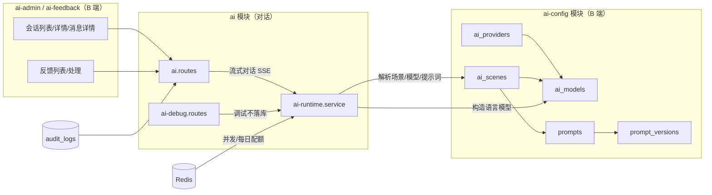

# AI 基础平台架构

> 蓝格 VICP 建筑节能 AI 智配系统后端 · AI 基础平台（第一期：`general_chat` 场景）

## 目标与边界

第一期建设"可配置、可运营、可追踪"的基础 AI 对话后端：

- **可配置**：服务商 / 模型 / 场景 / 提示词全部入库，版本化发布，运行时从数据库解析。
- **可运营**：B 端后台会话列表与详情、反馈处理、AI 调试、审计全链路。
- **可追踪**：每条消息记录实际模型、提示词版本、Token、耗时、错误码、requestId；重新生成与反馈不覆盖历史。

**硬边界**：

- C 端正式对话默认 `general_chat`，不要求用户选择场景或系统指令。
- 快捷提问独立于 Prompt / Scene；点击后走同一套 SSE 对话。
- 知识检索由能力路由自动启用，只检索已发布且当前用户有权访问的资料；不得编造来源。
- 场景 / Prompt 版本化保留给技术管理员，不作为业务管理员日常配置面。

## 模块关系

数据流向（发消息）：请求 → 权限/会话校验 → 配额 → 运行时解析（默认 general_chat → PUBLISHED 提示词 → 模型）→ 校验可选图片附件 → Vision 看图（如有）→ 能力路由 → 知识检索/项目上下文（无 projectId 则跳过）→ 用户消息与助手消息同事务落库 → SSE 握手 → 流式输出 → 完成落库。

## 提示词组装顺序

平台基础安全提示词（隐藏，Backend 自动附加） → 场景提示词（内部） → 项目上下文 → 检索结果（能力路由判定需要且有权检索时） → 热工/对比约束 → 历史窗口 → 当前用户消息。

## 状态机

消息状态：`PENDING` → `STREAMING` → `COMPLETED | STOPPED | FAILED`。

提示词版本：`DRAFT` → `PUBLISHED`（同一提示词全局唯一生效）→ `DISABLED`（被新版本替换）；已发布版本不可直接修改，编辑自动派生新草稿。

## 配额模型

- 并发：Redis `ai:active:{userId}`（EX 900s），上限 `AI_MAX_CONCURRENT_GENERATIONS`（默认 2），生成结束必须释放。
- 每日：Redis `ai:quota:{userId}:{yyyy-mm-dd}`（EX 26h），上限 `AI_DAILY_REQUEST_LIMIT`（默认 200）。
- `SUPER_ADMIN` 豁免；`GET /api/v1/ai/quota` 查询剩余额度。

## 一期之后的对话编排

- 知识库检索：正式聊天走 `searchWikiHierarchy`，仅 PUBLISHED + AI_ENABLED + 当前受控版本。
- 能力路由：`resolveAiCapabilities` 按问题启用知识/项目/热工/对比，不引入独立 Agent 框架。
- 快捷提问：`docs/ai/quick-prompt.md`。
- 热工计算、方案筛选仍走既有确定性接口，不由 Prompt 文本决定检索范围。