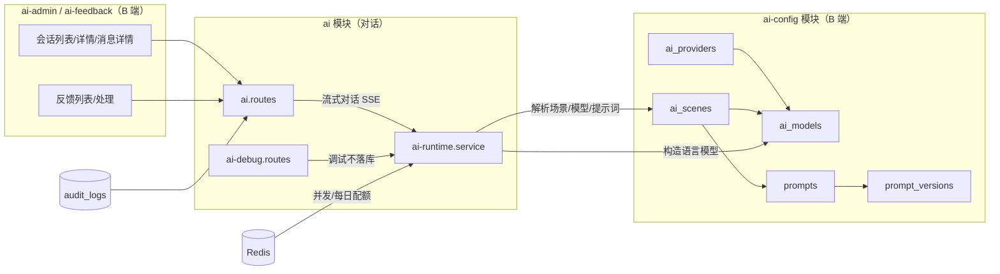

# AI 基础平台架构

> 蓝格 VICP 建筑节能 AI 智配系统后端 · AI 基础平台（第一期：`general_chat` 场景）

## 目标与边界

第一期建设"可配置、可运营、可追踪"的基础 AI 对话后端：

- **可配置**：服务商 / 模型 / 场景 / 提示词全部入库，版本化发布，运行时从数据库解析。
- **可运营**：B 端后台会话列表与详情、反馈处理、AI 调试、审计全链路。
- **可追踪**：每条消息记录实际模型、提示词版本、Token、耗时、错误码、requestId；重新生成与反馈不覆盖历史。

**硬边界**：

- 仅正式开放 `general_chat`；其余 5 个场景保留配置能力（`enabled=false`），未具备知识库/公式/工具能力前不得伪装完整业务能力。
- 禁止 Mock 冒充真实模型；不接知识库检索、热工计算、方案筛选、工具调用框架。
- 不重写既有会话 / SSE / 停止生成 / 重新生成 / 反馈能力。

## 模块关系

数据流向（发消息）：请求 → 权限/会话校验 → 配额（Redis 并发 + 每日）→ 运行时解析（场景 → PUBLISHED 提示词 → 模型）→ 用户消息与助手消息同事务落库 → SSE 握手 → 流式输出 → 完成落库（usage/耗时/错误码）。

## 提示词组装顺序

平台基础安全提示词 → 场景提示词 → 项目上下文（仅 `requireProject` 场景）→ 检索结果（仅 `allowKnowledgeSearch` 且有结果）→ 历史窗口（Token 预算裁剪）→ 当前用户消息。

## 状态机

消息状态：`PENDING` → `STREAMING` → `COMPLETED | STOPPED | FAILED`。

提示词版本：`DRAFT` → `PUBLISHED`（同一提示词全局唯一生效）→ `DISABLED`（被新版本替换）；已发布版本不可直接修改，编辑自动派生新草稿。

## 配额模型

- 并发：Redis `ai:active:{userId}`（EX 900s），上限 `AI_MAX_CONCURRENT_GENERATIONS`（默认 2），生成结束必须释放。
- 每日：Redis `ai:quota:{userId}:{yyyy-mm-dd}`（EX 26h），上限 `AI_DAILY_REQUEST_LIMIT`（默认 200）。
- `SUPER_ADMIN` 豁免；`GET /api/v1/ai/quota` 查询剩余额度。

## 一期缺口（记录在案）

- 知识库检索：仅场景门控字段接入，PDF 解析/索引未开发。
- 热工计算、方案筛选、工具调用框架未开发。
- 会话摘要、用户级 Token/费用配额（仅请求次数配额）、`capabilities.canUseAi` 落库未实现（沿用 `getInfo` 派生值）。
- 场景除 `general_chat` 外均为占位配置，不对外服务。