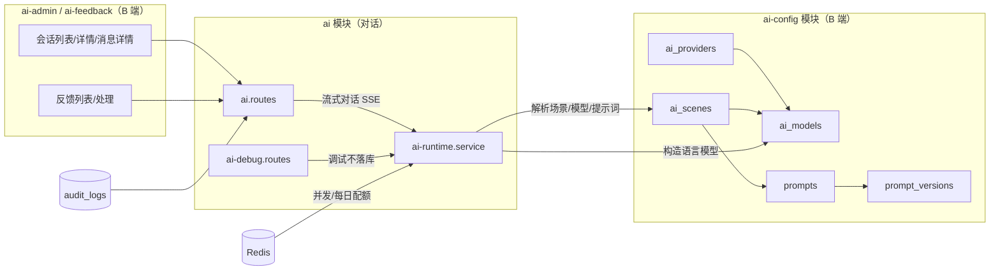

# AI 基础平台架构

> 蓝格 VICP 建筑节能 AI 智配系统后端 · AI 基础平台（第一期：`general_chat` 场景）

## 目标与边界

第一期建设"可配置、可运营、可追踪"的基础 AI 对话后端：

- **可配置**：服务商 / 模型 / 场景 / 提示词全部入库，版本化发布，运行时从数据库解析。
- **可运营**：B 端后台会话列表与详情、反馈处理、AI 调试、审计全链路。
- **可追踪**：每条消息记录实际模型、提示词版本、Token、耗时、错误码、requestId；重新生成与反馈不覆盖历史。

**硬边界**：

- C 端正式对话默认 `general_chat`，不要求用户选择场景或系统指令。
- 快捷提问独立于 Prompt / Scene；点击后走同一套 SSE 对话。
- 知识检索由能力路由自动启用，只检索已发布且当前用户有权访问的资料；不得编造来源。
- 场景 / Prompt 版本化保留给技术管理员，不作为业务管理员日常配置面。

## 模块关系

```mermaid
flowchart LR
    subgraph 配置面["ai-config 模块（B 端）"]
        P[ai_providers] --> M[ai_models]
        S[ai_scenes] --> M
        S --> PR[prompts]
        PR --> PV[prompt_versions]
    end

    subgraph 运行时["ai 模块（对话）"]
        RT[ai-runtime.service] -->|解析场景/模型/提示词| S
        RT -->|构造语言模型| M
        R[ai.routes] -->|流式对话 SSE| RT
        DBG[ai-debug.routes] -->|调试不落库| RT
    end

    subgraph 运营面["ai-admin / ai-feedback（B 端）"]
        AD[会话列表/详情/消息详情] --> R
        FB[反馈列表/处理] --> R
    end

    LQ[(Redis)] -->|并发/每日配额| RT
    AUD[(audit_logs)] --> R
```

数据流向（发消息）：请求 → 权限/会话校验 → 配额 → 运行时解析（默认 general_chat → PUBLISHED 提示词 → 模型）→ 校验可选图片附件 → Vision 看图并持久化语义 → 统一 `buildAiContext`（项目档案 + 项目记忆 + 会话滚动摘要 + 历史附件 + 近期消息）→ 若存在 `WAITING_USER_INPUT` 的 Agent Run 则 Resume → 否则 `resolveAiCapabilities` 只选择允许的 Tool Set → 支持 tools 的模型走 Agent Loop，否则回退单次 `streamText` → SSE → 完成后增量更新 Summary / 提取 Memory 候选。

## 提示词组装顺序

平台硬规则（`PLATFORM_BASE_SYSTEM_PROMPT`） → 执行规范（`EXECUTION_POLICY`） → 全局回答规则（`GLOBAL_RESPONSE_POLICY`，约 11 条） → Answer Contract（`DIRECT`/`KNOWLEDGE`/`PRODUCT`/`COMPARISON`/`REFERENCE_LOOKUP`/`THERMAL`/`CLARIFY`） → 业务 Prompt → 用户/权限范围 → 项目档案 / 项目记忆 / 会话摘要（仅供判断，默认不复述） → 近期消息 → 工具 / 知识 / 产品上下文 → 当前用户消息 → 代码层不可覆盖回答约束（`HARD_RESPONSE_CONSTRAINTS`）。

- **Execution Policy** 只影响“怎么做”，禁止模型改写成“我会检索/我不会编造”。
- **Global Response Policy** 统一负责“怎么说”（约 11 条核心规则）。Answer Contract 只约束最终答案形态，不是 Agent 类型。查询已有图集/参考档位用 `REFERENCE_LOOKUP`，正式计算/合规才用 `THERMAL`；不得仅因「传热系数 / K值」进入 `THERMAL`。业务 Prompt 只写该场景要关注什么。
- 项目上下文、记忆和摘要继续完整传给模型，不靠删上下文换精炼回答。
- 管理员可编辑业务 Prompt 的表达偏好，但不能覆盖：不得暴露内部 Tool/Agent、不得暴露思考链、权限不能绕过、不得伪造来源。

## 状态机

消息状态：`PENDING` → `STREAMING` → `COMPLETED | STOPPED | FAILED`。

提示词版本：`DRAFT` → `PUBLISHED`（同一提示词全局唯一生效）→ `DISABLED`（被新版本替换）；已发布版本不可直接修改，编辑自动派生新草稿。

## 配额模型

- 并发：Redis `ai:active:{userId}`（EX 900s），上限 `AI_MAX_CONCURRENT_GENERATIONS`（默认 2），生成结束必须释放。
- 每日：Redis `ai:quota:{userId}:{yyyy-mm-dd}`（EX 26h），上限 `AI_DAILY_REQUEST_LIMIT`（默认 200）。
- `SUPER_ADMIN` 豁免；`GET /api/v1/ai/quota` 查询剩余额度。

## 一期之后的对话编排

- 知识库检索：正式聊天走 `searchWikiHierarchy`，仅 PUBLISHED + AI_ENABLED + 当前受控版本。
- 能力路由：`resolveAiCapabilities` 只负责预路由、寒暄优化、安全限制与非 Agent 回退路径。统一 Conversation Runtime 不暴露独立 Comparison/Thermal/Report Agent。领域 Tools（`search_knowledge` / `get_project_state` / `get_product_data` / `thermal`（`LOOKUP_CANDIDATES` 查已发布参考档位 / `CALCULATE` 正式计算） / `compare_products` / `compare_solutions` / `generate_report`）在非寒暄时对模型可见。产品对比不强制热工；用户多选确认后写 Report Context Snapshot。查已有方案不要求地区/基层等项目级参数；结构化参考档位写入 `ConversationTaskState.lastReferenceLookup`，后续追问优先复用。选用表未命中时必须再检索知识库图集原文，不能把表空说成资料库没有方案。
- Agent Runtime：支持原生 Tool Calling 的模型走 `ai_agent_runs`（`streamText` + `tool()` + `stepCountIs`）。Tool `inputSchema` 必须是单一 object（禁止 discriminatedUnion/`oneOf`）。`fullStream` 按 Step 缓冲，Tool 前过渡文本不进入用户正文。停止必须立刻 CANCELLED 对应 run。WAITING_USER_INPUT 必须持久化 AI SDK 的 `responseMessages`（assistant tool-call / tool result / assistant text），Resume 不得只追加 `fullText`。不支持 tools 的聊天模型回退到单次生成，不得假装已具备完整 Agent 能力。
- 会话滚动摘要：`ai_conversation_states` 增量压缩历史；Token 裁剪前、消息数/token 阈值、会话结束、同项目新建会话、Agent 完成后触发。
- 项目长期记忆：`project_ai_memories` 跨 Conversation 共享；LLM 只提 candidate，冲突时 SUPERSEDED，ASSUMPTION 不得当事实注入。
- 快捷提问：`docs/ai/quick-prompt.md`。
- 热工计算、方案筛选仍走既有确定性接口，不由 Prompt 文本决定检索范围，也不由 LLM 代替计算器。