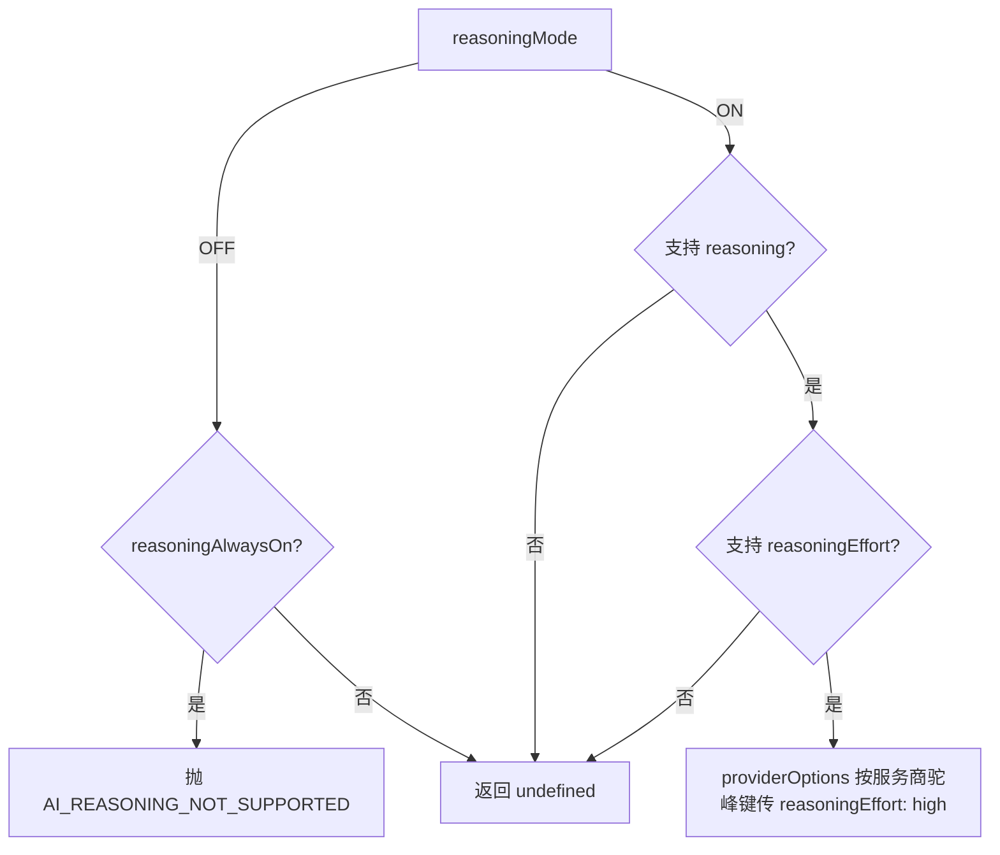

# AI 服务商与模型配置

## 服务商（`ai_providers`）

- 协议：一期仅 `OPENAI_COMPATIBLE`（AI SDK `createOpenAICompatible` 适配）。
- API Key：AES-256-GCM 加密落库（ciphertext + iv + tag 分列），响应只返回 `hasApiKey`，任何接口、日志、审计不得出现密钥材料。
- 编辑时留空 `apiKey` 表示不覆盖原密钥。
- 字段：`code`（唯一）、`baseUrl`、`timeoutMs`（默认 60000）、`priority`、`description`、`enabled`。
- 删除：存在关联模型时拒绝（ConflictError）。
- 测试连接：`POST /api/v1/platform/ai/providers/:id/test-connection`（`system:ai:provider:test`），选取该服务商下 priority 最高且启用的模型发起最小请求，结果写 `lastTestStatus/lastTestMessage/lastTestAt` + 审计；错误信息脱敏。

## 模型（`ai_models`）

- 同服务商下 `modelId` 唯一；`code` 为业务编码。
- `capabilities` 白名单键（Zod 校验，非法键拒绝）：

| 键 | 含义 |
| --- | --- |
| `text` / `streaming` | 文本生成与流式 |
| `reasoning` | 支持深度思考（可通过参数控制） |
| `reasoningEffort` | 支持力度参数（reasoning 模式下传 `reasoningEffort: high`） |
| `reasoningAlwaysOn` | 始终推理，不可关闭 |
| `tools` / `vision` / `files` / `structuredOutput` | 工具 / 视觉 / 文件 / 结构化输出 |

- Agent 主模型必须 `tools=true`。优先 `code=default_agent`，否则取 tools 能力中 priority 最高者。普通聊天模型若不支持 Tools，运行时拆分为 Chat Model / Agent Model / Vision Model，不得假装无工具模型已具备完整 Agent 能力。
- `resolveDefaultVisionModel`：启用模型中 `capabilities.vision=true`，优先 `code=default_vision`。
- `resolveAgentModelOrNull`：启用模型中 `capabilities.tools=true`，优先 `code=default_agent`；未配置则对话回退单次生成。

- 关联服务商必须存在且启用；新增模型时同 provider 下 `modelId` 唯一约束由数据库保证。

## 模型解析（运行时）

- `resolveModelById`：模型 → 服务商 → 构造 `createOpenAICompatible` 语言模型，模型或服务商不可用 / 停用时报 `AI_MODEL_UNAVAILABLE` / `AI_PROVIDER_UNAVAILABLE`。
- `resolveDefaultVisionModel`：启用模型中 `capabilities.vision=true`，优先 `code=default_vision`，否则取 priority 最高者；没有可用视觉模型时报 `VISION_MODEL_NOT_CONFIGURED`。业务代码不得写死 provider/model id。
- `resolveReasoningProviderOptions`：

- 降级规则（场景解析）：`reasoningMode=ON` 时优先 `reasoningModelId`；不可用则降级 `defaultModelId`，`metadata.downgradeNote` 记录说明。
- Fallback：主模型在未产出任何 token 时失败且配置了 `fallbackModelId` 时重试一次（`metadata` 记录 `originalFailedModel/actualModel`），不无限重试。