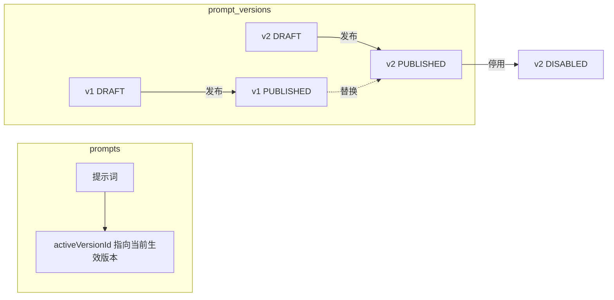

# 场景与提示词版本化

## 场景（`ai_scenes`）

| 字段 | 说明 |
| --- | --- |
| `code` | 唯一业务编码，六个内置场景 |
| `defaultModelId` / `reasoningModelId` / `fallbackModelId` | 模型绑定（FK `ai_models`，onDelete set null） |
| `allowReasoning` | 是否允许深度思考（ON 模式前置条件） |
| `requireProject` | 是否注入项目上下文 |
| `allowFileUpload` / `allowKnowledgeSearch` / `allowTools` | 能力门控（一期仅占位，未实现实际能力） |
| `temperature` / `maxOutputTokens` | 场景级覆盖参数 |
| `promptId` | 关联提示词（FK `prompts`） |
| `enabled` | 是否对外服务 |

内置场景（seed）：`general_chat`（仅此启用）、`project_design`、`material_compare`、`standard_qa`、`report_generate`、`information_extract`（后五个 `enabled=false` 占位，不对外服务）。

> 约束：`reasoningModelId` 必须是 `supportsReasoning` 模型；`general_chat` 可编辑配置，但停用需明确确认（运营保护）。

## 提示词（`prompts` + `prompt_versions`）

- 版本号服务端自动递增（同一 promptId 内唯一），前端传入的版本号被忽略。
- 同一 promptId 下 `PUBLISHED` 版本全局唯一（partial unique index）；发布新版本自动将旧生效版本置为 `DISABLED` 并更新 `prompts.activeVersionId`。
- 已发布 / 已停用状态不可直接修改：编辑草稿时若当前无草稿，自动从生效版本复制派生新草稿（历史版本永不改写）。
- 回滚：将目标历史版本复制为新草稿再发布，不破坏版本历史。

## 版本生命周期接口（`/api/v1/platform/ai/prompts`）

| 操作 | 接口 | 权限码 |
| --- | --- | --- |
| 列表 / 创建 | `GET|POST /prompts` | `system:ai:prompt:list` / `system:ai:prompt:add` |
| 详情 | `GET /prompts/:id` | `system:ai:prompt:list` |
| 编辑草稿 | `PATCH /prompts/:id/draft` | `system:ai:prompt:edit` |
| 发布 | `POST /prompts/:id/publish` | `system:ai:prompt:publish` |
| 停用 | `POST /prompts/:id/disable` | `system:ai:prompt:publish` |
| 版本列表 / 对比 | `GET /prompts/:id/versions`、`GET /prompts/:id/versions/compare?from=&to=` | `system:ai:prompt:list` |
| 回滚 | `POST /prompts/:id/versions/:versionId/rollback` | `system:ai:prompt:publish` |
| 删除 | `DELETE /prompts/:id` | `system:ai:prompt:remove` |

所有变更写审计。

## 兼容路径

`GET|PUT /api/v1/platform/ai/scene-bindings` 保留原路径，按 `code` upsert，响应在原字段基础上扩展（`defaultModelId` ↔ 原 `primaryModelId` 语义兼容），不破坏存量前端。