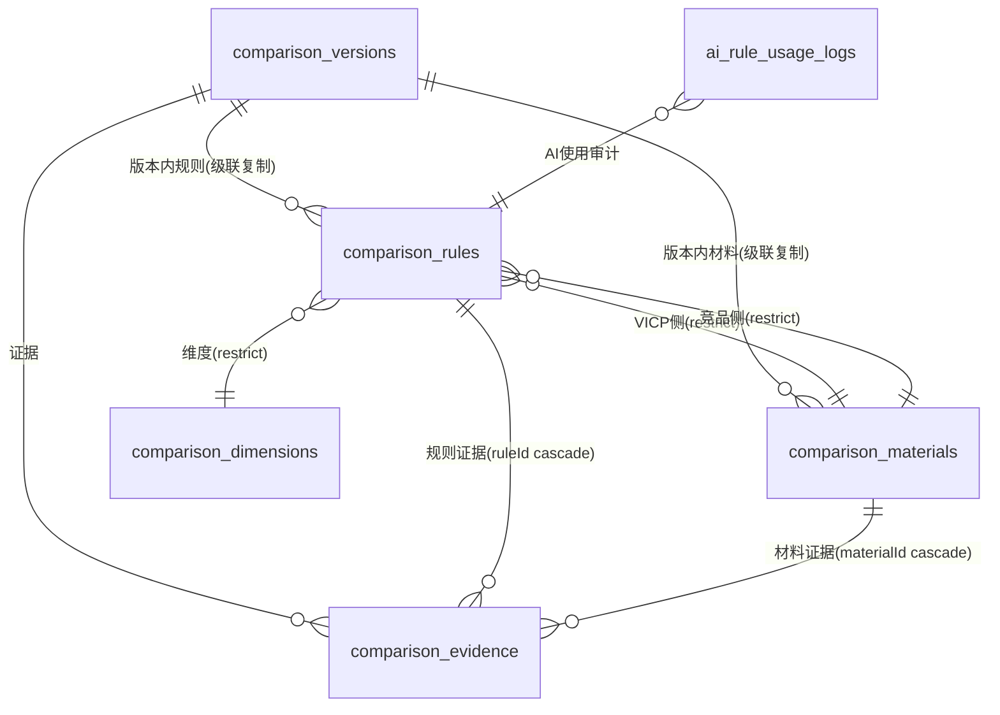
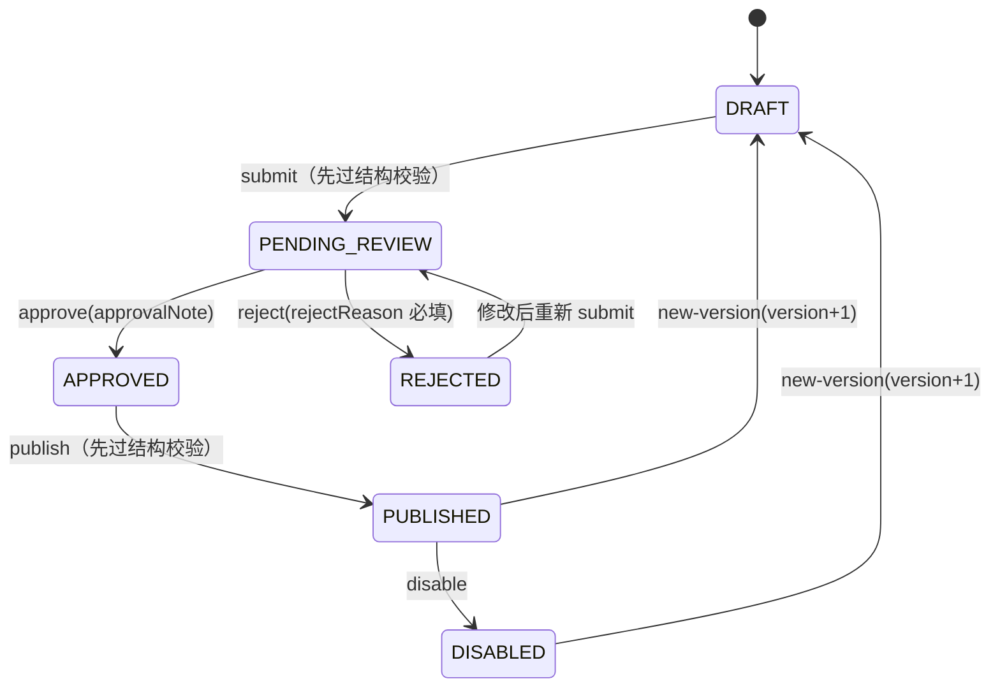

# 材料对比规则引擎（comparison 模块）

VICP 与 EPS / XPS / 岩棉 / 聚氨酯 / 传统一体板的对比，**不做 AI 自由生成**，全部收敛为审核后的结构化规则：B 端录入 → 审核 → 发布 → AI 对话以 prompt 注入方式只读消费，营销文案（`advantage_text`）与技术/合规输出项（`applicability` / `mandatory_disclosure`）在发布前强制完整，AI 不得省略披露项。

- 库分工：**知识库**负责条文检索/解释/页码引用；**本模块**负责产品/系统/构造/热工数据之外的对比规则、维度、材料、证据与确定性筛选。
- 关系链：保温系统 → 构造方案 → 构造层 → 产品规格 → 图集热工结果 → 地区标准限值 → 候选方案（材料对比规则为该链之外的独立审核数据源，服务于 `material_compare` 场景）。
- AI 消费方式：**prompt 注入**（非 tool calling），只读已发布且生效中的规则；回答完成后按引用规则写入使用日志（含快照，审计不漂移）。

## 数据模型（6 张表 + 3 枚举）



- `comparison_versions`：版本化头实体，同 `code` 多版本行，唯一 `(code, version)`；状态/审核/证据/时间戳列与 masterdata 约定一致。
- `comparison_materials`：随版本复制；`category` 枚举 VICP / EPS / XPS / ROCK_WOOL / PU / TRADITIONAL_BOARD；`density` + `density_unit` + `test_conditions` 承载型号口径，**防混比**（不同型号/密度/测试条件 = 不同材料行）；唯一 `(version_id, category, name, model)`。
- `comparison_dimensions`：全局配置（不挂审核状态机）。seed 预置五维：`thermal` 保温 / `fire` 防火 / `durability` 耐久 / `construction` 施工 / `approval` 报审，服务层禁止删除/禁用五维（`COMPARISON_DIMENSION_FIXED`）；子指标（parentId 自引用，set null）B 端扩展。
- `comparison_rules`：随版本复制；`dimensionName` / `subIndicatorName` 快照列（历史展示不随后台配置漂移）；双方材料 FK **restrict** 且必须同版本（写入时 `assertRuleReferences` 强制）；`benchmarkType` 枚举 SAME_THICKNESS / SAME_LAMBDA / SAME_R_VALUE / PERFORMANCE / OTHER + `benchmarkDesc`（统一比较基准）；`competitor_value` 可空——定量不足时只输出 VICP 自身已验证表现，不生成对方负面结论；`advantageText`（营销/展示口径，须有证据支撑）/ `applicability`（适用条件）/ `mandatoryDisclosure`（必要披露与风险提示）发布前强制非空；`forbiddenWording`（禁止措辞）仅记录不参与 AI 输出；唯一 `(version_id, dimension_id, vicp_material_id, competitor_material_id, benchmark_type)`。
- `comparison_evidence`：随版本复制；挂规则（ruleId cascade）或材料（materialId cascade），check 约束至少其一；`side` VICP / COMPETITOR；`evidenceLevel` A/B/C（复用知识库证据等级枚举）。
- `ai_rule_usage_logs`：AI 审计，`ruleSnapshot` jsonb 存引用时完整规则快照（历史不漂移）；`ruleCode` = 版本 code（规则本身无独立编码）。

## 统一状态机（复用 masterdata `md-workflow.service.ts`）



- 模块加载时 `registerVersionedEntity("comparisonVersion", ...)` 注册，submit/approve/reject/publish/disable/new-version 由 `registerVersionedWorkflow` 工厂直接复用（不复制状态机）。
- **new-version 子表快照**：同事务内复制材料 → 规则（双方材料 FK 重映射）→ 证据（ruleId/materialId 重映射），历史版本子表不漂移。
- 子表（材料/规则/证据）无独立工作流：版本处于 DRAFT / PENDING_REVIEW / REJECTED 时可增删改，其余状态拒绝；删除草稿版本级联删除子表。
- **submit 与 publish 前强制结构校验**（`collectComparisonViolations`，失败抛 `COMPARISON_STRUCTURE_INVALID`）：
  1. 版本至少一条规则；
  2. 规则引用的材料存在且类别正确（VICP 侧为 VICP、竞品侧非 VICP）；
  3. `vicpValue > 0`；填写 `competitorValue` 必须同时填 `competitorUnit`；
  4. 每条规则至少一条 VICP 侧证据；有竞品数值时必须提供竞品侧证据；
  5. `advantageText` / `applicability` / `mandatoryDisclosure` 非空；
  6. `effectiveAt <= expiresAt`（两者均填时）。
- 另提供 `POST /versions/:id/validate` 显式校验：返回 `{ valid, violations }` 不抛错。
- 所有状态转换与 `writeAuditLog` 同事务；审计 action 用模块内稳定字符串（`comparison.*`），不新增全局审计常量。

## 权限码（`system:comparison:*`）

| 域 | 权限码 |
| --- | --- |
| 材料对比 | `system:comparison:{list,add,edit,remove,approve,publish}` |

种子单一事实源：`src/shared/comparison-permissions.ts`，合并进 `src/db/seed.ts` 幂等写入；`platform_admin` 自动全量，SUPER_ADMIN 直通。

## API

### B 端（前缀 `/api/v1/platform/comparison`，标签 `B端 / 平台 / 材料对比`）

工作流端点：`POST /versions/:id/{submit|approve|reject|publish|disable|new-version}`（submit/publish 先过 `validate` 钩子）。权限映射：list=`:list`、add=`:add`、edit/remove=`:edit`（子表同）、approve/reject=`:approve`、publish/disable/new-version=`:publish`。

| 资源 | 端点 |
| --- | --- |
| 版本 | `GET/POST /versions`、`GET/PUT/DELETE /versions/:id`（delete 仅 DRAFT/REJECTED）、`POST /versions/:id/validate` |
| 材料 | `GET/POST /versions/:id/materials`、`PUT/DELETE /materials/:id`（被规则引用不可删） |
| 规则 | `GET/POST /versions/:id/rules`、`POST /versions/:id/rules/batch`（JSON 批量导入，单事务，材料按 `materialKey` 关联）、`PUT/DELETE /rules/:id` |
| 证据 | `GET /versions/:id/evidence`、`POST /rules/:id/evidence`、`PUT/DELETE /evidence/:id` |
| 维度 | `GET/POST /dimensions`、`PUT/DELETE /dimensions/:id`（五维不可删/禁用，有子指标/被引用不可删） |
| 已发布读取 | `GET /published/rules?competitorCategory=&dimensionCode=&effectiveDate=`（只 PUBLISHED+生效中） |

响应统一 `ok()` 包装 `{success, data, requestId}`；DTO 见 `src/modules/comparison/comparison.schemas.ts`；列表分页 `page`（默认 1）/`pageSize`（1-100，默认 20）。

### AI 端（前缀 `/api/v1/ai/comparison`，标签 `PC AI端 / 材料对比`）

- `POST /rules`：C_APP/PC_AI 客户端 + projectId 必填 + `canViewProject` 项目守卫（照 `ai-thermal.routes.ts`）；body 仅接受筛选条件，返回规则列表含双方材料与证据。**状态门禁在 `comparison-read.service.ts` 服务内强制**（只读 PUBLISHED + 生效区间），调用方无法传 status 绕过。

## AI 集成（prompt 注入，`material_compare` 场景）

- `src/modules/comparison/material-compare.service.ts`：
  - `loadApprovedComparisonRules(app, { competitorCategory?, dimensionCode?, limit? })`：只读已发布规则；
  - `formatComparisonRuleContext(rules)`：渲染中文上下文（维度/基准/数值/双方材料型号密度测试条件/优势口径/适用条件/必要披露/证据页码等级）；竞品数值缺失时输出"只陈述 VICP 自身已验证表现，不得生成对方负面结论"；`forbiddenWording` 不参与输出；
  - `logComparisonRuleUsage(app, actor, { conversationId, messageId, rules })`：批量写 `ai_rule_usage_logs`（含快照）。
- `src/shared/prompt-assembly.ts`：`buildSystemMessages` 新增 `ruleContext` 可选参数，渲染为 `【已审核材料对比规则（必须遵守，禁止自由编造对比数据）】` 段（顺序：平台基础 → 场景 → 项目上下文 → 规则 → 知识检索 → 历史 → 当前消息）。
- `src/modules/ai/ai.routes.ts`：发送消息与 regenerate 两处，`conversation.scene === AI_SCENES.MATERIAL_COMPARE` 时加载规则注入 system；回答完成后写使用日志。
- `src/db/seed.ts`：`material_compare` 场景已开启（enabled=true）；模型绑定由 B 端场景绑定接口配置。
- 数据层兜底：publish 校验保证 `applicability` + `mandatoryDisclosure` 非空，场景提示词要求营销/技术两种模式均不得省略披露项，不依赖模型自觉。

## 导入示例

```bash
pnpm comparison:import-example
```

`scripts/comparison-import-example.mjs`：直连 `DATABASE_URL` 创建 `VICP-VS-COMPETITORS-2026` v1 DRAFT 版本 + 六条材料（VICP + 五类竞品）+ 五条规则（同厚度基准）+ 双侧证据，按逻辑键幂等跳过；**数值/型号/密度/页码全部占位并标注"待甲方确认"**。正式数据由甲方提供，B 端审核发布后 AI 场景才可消费。

## 待甲方确认项（当前以占位数据 + 文档标注处理）

1. 《材料对比》PPT 全部具体数值、型号、密度、测试条件及对应页码/条款。
2. 统一比较基准的业务口径（同厚度/同导热系数/同热阻等）及各维度适用基准。
3. 五维下子指标清单（保温的导热系数/热阻/蓄热等是否按此划分）。
4. 竞品材料类别完整清单与型号口径（EPS/XPS/岩棉/聚氨酯/传统一体板的具体规格基准）。
5. 营销模式与正式技术报告模式的文案边界、必要披露项的强制清单。
6. `material_compare` 场景提示词最终措辞（现有种子为占位）。