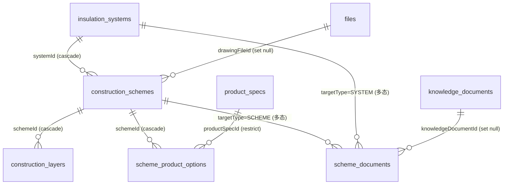
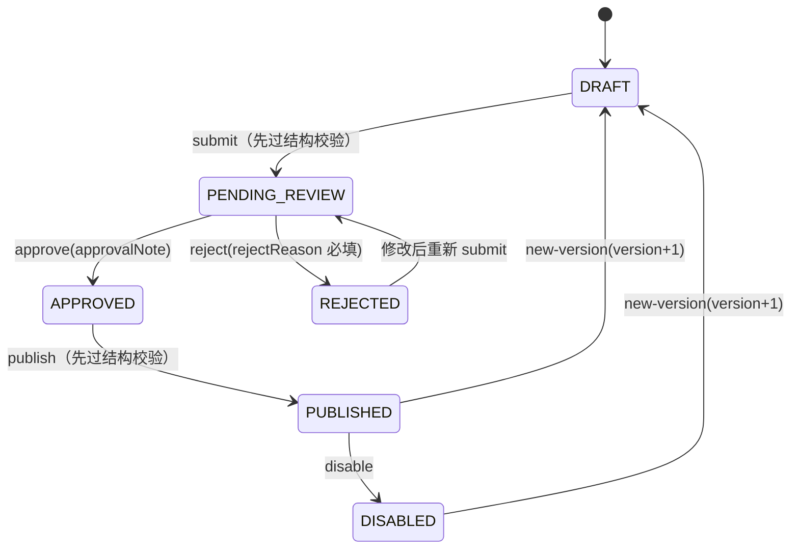

# 保温系统 / 构造方案（构造模块）

保温系统与构造方案的版本化管理：保温系统（外墙外保温等）下挂多个构造方案（图集编号如 A1-1），方案由构造层（外到内层序）、产品选项（允许厚度范围）与方案文档组成，全部经过"提交 → 审核 → 发布"状态机后进入**只读的已发布读取服务**，供未来图集热工查表模块确定性取数。

- 结构化库分工：**知识库**负责条文检索/解释/页码引用；**主数据**（masterdata）负责产品/材料参数；**构造模块**负责系统/方案/层/选项组合；图集热工结果表（K 值）为后续任务，本模块模型为其查表打底。
- 本模块为独立模块（不并入 masterdata），但状态机、证据列、审核列、错误模板、权限 seed 模式全部复用主数据既有设施。

## 数据模型（5 张表 + 2 枚举）



- `insulation_systems`：保温系统（版本化），同 `code` 多版本行并存，唯一 `(code, version)`；`systemType` 值域待甲方确认，暂用文本。
- `construction_schemes`：构造方案（版本化），唯一 `(systemId, schemeCode, version)`；`schemeCode` 为图集编号（如 A1-1）；保存基层材料/厚度、构造简图文件（`drawingFileId` set null）、图集页码。
- `construction_layers`：构造层（随方案版本复制，无独立审核列），`layerOrder` 外到内从 1 递增，唯一 `(schemeId, layerOrder)`；`layerType` 四类：`BASE_LAYER`（基层，最内层）/`PRODUCT_LAYER`（产品层）/`FIXING_LAYER`（固定层）/`VARIABLE_LAYER`（饰面/找平等可变层）；产品层与基层层各自部分唯一索引（同一方案内各唯一）。
- `scheme_product_options`：产品选项（随方案版本复制），方案允许绑定的产品规格 + 允许厚度区间 `[minThickness, maxThickness]`（mm），唯一 `(schemeId, productSpecId)`；`productSpecId` **restrict**（防误删被引用规格）。
- `scheme_documents`：方案文档（随方案版本复制，仿 `product_attachments` 多态），`targetType + targetId` 无 DB 外键、应用层校验目标存在且可编辑；唯一 `(targetType, targetId, knowledgeDocumentId)`。

所有专业数据行含通用证据列（`evidence_source`/`evidence_ref` 页码条款/`evidence_level` A/B/C/`effective_at`/`expires_at`）与时间戳；版本化主体另含审核列（四段决议）与 `version`/`change_note`。

## 统一状态机（复用 masterdata `md-workflow.service.ts`）



- 构造模块加载时通过 `registerVersionedEntity` 注册 `insulationSystem` / `constructionScheme` 两个版本化实体，submit/approve/reject/publish/disable/new-version 与 masterdata 同一套实现（`registerVersionedWorkflow` 工厂共用，不复制）。
- **new-version 子表快照**：派生新版本时在**同一事务**内把构造层/产品选项/方案文档整组复制到新行（`schemeId`/`targetId` 指向新版本），历史版本子表保留不漂移。
- 子表（层/选项/文档）无独立工作流：父方案处于 DRAFT/PENDING_REVIEW/REJECTED 时可增删改，其余状态拒绝；删除父草稿级联删除子表。
- **submit 与 publish 前强制结构校验**（`construction-structure.service.ts`），失败抛 `CONSTRUCTION_STRUCTURE_INVALID`（中文违规明细汇总）：
  1. `layerOrder` 从 1 连续唯一（外到内）；
  2. `BASE_LAYER` 唯一且为最内层（order 最大）、`PRODUCT_LAYER` 唯一；
  3. 产品层厚度必填且 > 0，且必须落在某个产品选项的 `[min, max]` 内，无选项报缺失；
  4. 选项 `min <= max`，`defaultThickness` 若填写须落在区间内；
  5. 引用的 `productSpecId`/`materialId` 必须为**已发布且生效中**（禁止引用草稿/失效数据，抛 `CONSTRUCTION_REFERENCE_NOT_PUBLISHED`）；
  6. `effectiveAt <= expiresAt`（两者均填时）。
- 另提供 `POST /construction-schemes/:id/validate` 显式校验：返回 `{ valid, violations }` 不抛错，前端可逐条展示。
- 所有状态转换与 `writeAuditLog` 同事务；审计 targetType 用实体 kind（`construction_insulation_system` / `construction_scheme` 等），`AUDIT_ACTIONS.MD_ENTITY_*` 不新增常量。

## 权限码（`system:construction:*`）

| 域 | 权限码（list/add/edit/remove/approve/publish） |
| --- | --- |
| 保温系统 | `system:construction:{list,add,edit,remove,approve,publish}` |

构造方案/构造层/产品选项/方案文档与保温系统共用同一组 `system:construction:*` 权限码。种子单一事实源：`src/shared/construction-permissions.ts`（`CONSTRUCTION_PERMISSIONS` + `CONSTRUCTION_PERMISSION_SEEDS`），合并进 `src/db/seed.ts` 幂等写入；`platform_admin` 自动全量。SUPER_ADMIN 直通。

## API（前缀 `/api/v1/platform/construction`，标签 `B端 / 平台 / 构造方案`）

工作流端点（版本化实体 2 个）：`POST /{entity}/:id/submit|approve|reject|publish|disable|new-version`；submit 与 publish 先执行结构校验（`validate` 钩子）。权限映射：list=`:list`、create=`:add`、update/delete=`:edit`（子表同）、submit=`:add`、approve/reject=`:approve`、publish/disable/new-version=`:publish`。

| 资源 | 端点 |
| --- | --- |
| 保温系统 | `GET/POST /insulation-systems`、`GET/PATCH/DELETE /insulation-systems/:id` + 工作流 |
| 构造方案 | `GET/POST /construction-schemes`（列表支持 systemId/schemeCode 过滤）、`GET/PATCH/DELETE /construction-schemes/:id` + 工作流；`POST /construction-schemes/:id/validate` 显式结构校验 |
| 构造层 | `GET/POST /construction-schemes/:schemeId/layers`、`PATCH/DELETE /construction-layers/:id`（随父方案状态，无独立工作流） |
| 产品选项 | `GET/POST /construction-schemes/:schemeId/product-options`、`PATCH/DELETE /scheme-product-options/:id` |
| 方案文档 | `GET/POST /construction-schemes/:schemeId/documents`（挂 SCHEME 目标）、`PATCH/DELETE /scheme-documents/:id`；保温系统文档用通用 body `targetType: SYSTEM` + `targetId` |
| 已发布读取 | `GET /published/insulation-systems`、`GET /published/construction-schemes`、`GET /published/construction-schemes/:id`（聚合层/产品选项/文档） |

响应统一 `ok()` 包装 `{success, data, requestId}`；DTO Zod 挂在 `schema.response`（见 `src/modules/construction/construction.schemas.ts`）；列表分页 `page`（默认 1）/`pageSize`（1-100，默认 20）。

## 已发布读取（计算模块取数入口）

`src/modules/construction/construction-read.service.ts` 只返回 **PUBLISHED 且 `effective_at <= now <= expires_at`** 的系统/方案；详情聚合时子表同样按生效区间过滤。状态过滤在服务内强制，调用方无法传状态参数绕过。供未来图集热工查表模块取数。

## 导入示例

```bash
pnpm construction:import-example
```

`scripts/construction-import-example.mjs`：直连 `DATABASE_URL` 插入外墙外保温系统 + A1-1/A1-2 占位方案与构造层（全部落 DRAFT，按逻辑键幂等跳过）；产品选项引用 `md:import-example` 导入的示例规格。占位数据引用未发布规格/材料时 submit 会被结构校验拒绝（期望行为），真实图集数据需人工录入并先发布引用数据。

## 待甲方确认项（当前以可空字段 + 文档标注处理）

1. A1-1 与 A1-2 的真实构造层组合（层序、基层材料、基层厚度、固定层、各层厚度）——需从图集页面人工录入，仓库无来源。
2. 保温系统类型（`systemType`）值域（外墙外保温/内保温/屋面/地面等）——暂用文本字段。
3. 图集选用表中各方案的允许产品厚度集合（决定产品选项的 min/max 默认值）。
4. 基层材料取值集合（钢筋混凝土/加气混凝土砌块等）是否与 `materials` 表关联。
5. 构造层类型枚举是否还有图集中出现的其他层型（如饰面层、找平层归入 `VARIABLE_LAYER` 的归类口径）。
6. 构造简图文件来源与格式（图集 PDF 截取 or 独立 CAD 图纸）。