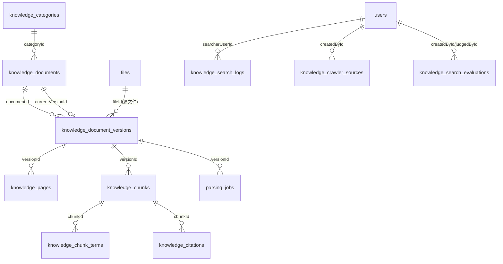
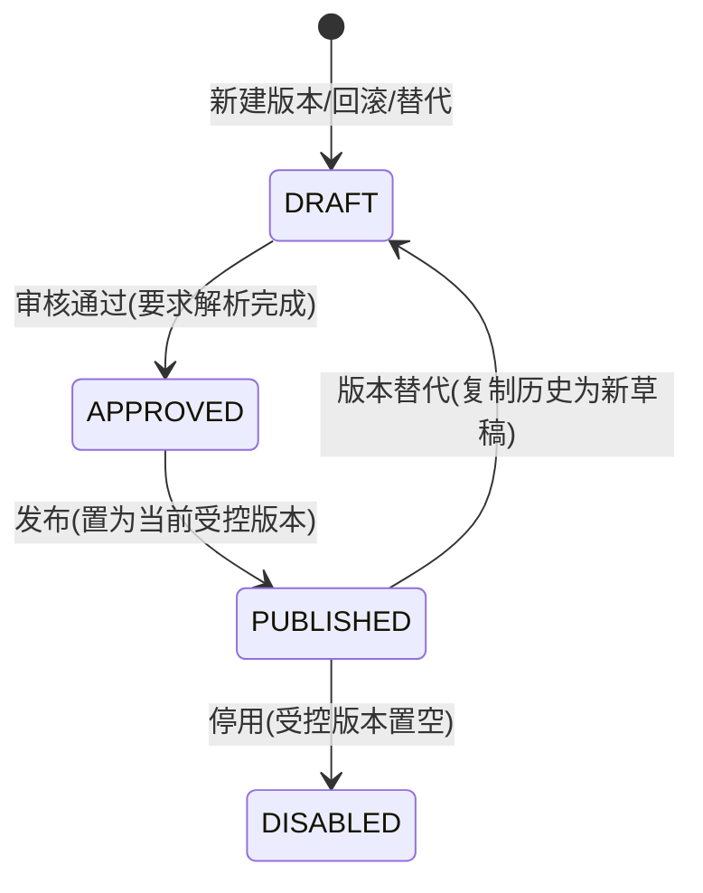

# 知识库（非向量底座）

可追溯知识库：原文件进 OSS/MinIO，解析后的页面/分块进 PostgreSQL，支持版本发布、来源引用与确定性检索。第一批只做文本切片，OCR 仅预留任务类型。

## 数据模型



- `knowledge_documents`：文档元数据（docNumber/docType/sourceOrg/issueDate/effectiveDate/evidenceLevel/allowedPurposes/categoryId/region），`status` ACTIVE/DISABLED，软删除 `deletedAt`，`currentVersionId` 指向当前受控版本。`fileId` 可空——文件归属移到版本表，旧数据由迁移回填。
- `knowledge_document_versions`：版本从 1 起，唯一 `(documentId, version)`；`fileId` 记录源文件（→ files → OSS/MinIO 对象）；状态机见下；`parseStatus` 跟踪解析进度，`pipelineStatus`（UPLOAD_PENDING/UPLOADED/PARSING/CHUNKING/REVIEW_PENDING/PUBLISHED/FAILED）跟踪处理管线——解析成功置 REVIEW_PENDING 待人工审核，发布时两轨均置 PUBLISHED。
- `knowledge_pages`：按 `(versionId, pageNumber)` 唯一，保存解析文本、页码、章节路径、表格/图片标记。
- `knowledge_chunks`：版本化分块，唯一 `(versionId, chunkIndex)`；含 `searchText`（归一化文本，trgm GIN 索引）、`keywords`（GIN）、`citationAnchor`（如"表3.2-1"）、`headingLevel`、`contentType`（表格区域独立成 TABLE 块，metadata 存 sheet/行列/合并单元格）。
- `knowledge_chunk_terms`：分块命中的术语（KEYWORD/SYNONYM/ENTITY/CLAUSE_NO）。
- `knowledge_aliases`：别名词典（规范词 term + 别名 alias，GLOBAL/PROJECT 作用域），检索与分块标注共用。
- `knowledge_citations`：分块 → 文档/版本/页码/条款号，追溯引用。
- `knowledge_search_logs`：检索日志（query/过滤器/命中模式/前 N 条结果/耗时）。
- `parsing_jobs`：解析任务（PARSE/REPARSE/CHUNK_REBUILD/OCR），状态 QUEUED/ACTIVE/COMPLETED/FAILED/OCR_REQUIRED。
- `files`：`source` 枚举 USER_UPLOAD/BATCH_IMPORT/CRAWLER/INTERNAL_API + `sha256` 索引（去重在服务层抛 409，不做库级唯一）。
- `knowledge_ranking_rules`：检索排序规则（key/weight/enabled），种子见 `knowledge-ingest.service.buildRankingRuleSeeds`，B 端可调。
- `knowledge_crawler_sources`：抓取源（baseUrl/downloadUrlPattern/docType/enabled），定时/手动触发 `runCrawlerSource`。
- `knowledge_search_evaluations`：检索评测（query/parsedKeywords/expectedDocumentId/actualTopResults/judgement PENDING→APPROVED/REJECTED/PARTIAL）。

迁移 `drizzle/0011_*.sql` 对存量数据回填：每个旧文档生成 v1 版本并置 `PUBLISHED`（维持现状可用性），`currentVersionId` 指向它，存量 chunks 回填 versionId；旧数据无页面粒度，版本标记 `PARTIAL`，可手动触发 REPARSE 补齐。`drizzle/0012_*.sql` 新增上述三表与列，并按 status/parseStatus 回填 pipelineStatus。

## 版本状态机



- 只有 `PUBLISHED` 版本参与检索；检索同时要求文档 `status=ACTIVE` 且未软删除。
- 已发布/已停用版本不允许重新解析或重建分块，需基于历史版本回滚生成新草稿。
- 文档软删除要求该文档没有任何 PUBLISHED 版本。

## Wiki 层级知识体系与层级检索

知识组织与阅读层为 Document → Section（`knowledge_sections` 章节树）→ Page（`knowledge_pages` 完整页）→ Page Block（`knowledge_page_blocks` 标题/段落/表格/图片块）；`knowledge_chunks` 保留为辅助检索索引，不再是唯一、默认的知识回答单位。

- AI 侧检索入口 `searchWikiHierarchy`（knowledge.service.ts）：① 章节层（search_text/标题/条款号）→ ② 页面内容块层（pg_trgm/全文）→ ③ Chunk 辅助召回（复用 `runSearch` 打分管线）；结果按 sectionId/pageId 聚合去重并带 `retrievalUnit`（SECTION/PAGE/BLOCK/CHUNK）。
- 小资料整节进入上下文：节内内容 ≤ 2000 字（`SECTION_FULL_TEXT_LIMIT`）时整节返回，不做二次切碎。
- 保温体系联动：`knowledge_documents.insulation_system_id` 标注列 + `INSULATION_SYSTEM_MATCH` 权重（缺省 22）对体系文档强加权，未标注文档兜底召回。
- AI 会话检索范围：项目文档 + 平台级已发布文档（`projectScope=project-and-global`）。
- 历史资料升级：`CHUNK_REBUILD` 从页面原文重建 章节→内容块→兼容 Chunk（已发布版本允许，且不降级管线状态）；批量回填脚本 `pnpm backfill:knowledge-wiki`（--dry-run 预览、--limit 分批）。
- C 端公开文库与 AI 来源详情共用 `knowledge-wiki-read.service.ts`：只读 PUBLISHED+生效中版本；公开文库只暴露 `visibility=PUBLIC` 文档；来源详情支持 sectionId/pageId/blockId/chunkId 任一定位入口，高亮优先 block 文本在页全文定位、matchedText 兜底。

## 检索管线


1. 输入归一化（NFKC + 空白折叠 + 小写，`normalizeSearchText`）。
2. 别名词典扩展：查询含别名 → 补规范词（关键词匹配）；查询含规范词 → 补别名（别名匹配）。
3. 权重从 `knowledge_ranking_rules` 读取（每请求一次，未配置种子时兜底默认值）；参数化 SQL 混合打分（postgres.js，禁止拼接用户输入）：
   - 标题命中 `kd.title/kdv.title ILIKE`（TITLE_HIT，默认 30）
   - 条款号命中 `citation_anchor/content` 含条款号 token（CLAUSE_NO_HIT，默认 25）
   - 短语命中 `ILIKE %query%`（PHRASE_HIT，默认 20）
   - 关键词扩展命中 `unnest(patterns) ILIKE`（KEYWORD_HIT，默认 5/个）
   - 别名扩展命中（ALIAS_HIT，默认 4/个）
   - 全文 `to_tsvector('simple') @@ plainto_tsquery`（FULLTEXT_HIT，默认 1，英文/编号有效）
   - 模糊 `word_similarity`（FUZZY_HIT，默认 0.5，pg_trgm，> 0.08）
   - 证据等级 A 加分（EVIDENCE_LEVEL_BONUS，默认 3）
   - 当前受控版本加分（CURRENT_VERSION_BONUS，默认 2）
4. 每条结果输出可解释 `matchReasons`（多分量数组，顺序即优先级）+ 兼容单值 `hitReason`；附带 `snippet`（命中词 ±40 字符）、`matchedTerms`、`rankScore`、`evidenceLevel`、`usageScope`、`region`。
5. 过滤参数：`docType`/`categoryId`/`region`（精确匹配）/`purpose`（allowed_purposes 包含或为空数组）。
6. 平台侧检索写 `knowledge_search_logs`；AI 侧 `searchProjectKnowledge` 保持原签名（按项目过滤、不写日志）。

## 多来源接入与去重

- B 端单文件：预签名直传 + upload-complete 校验（大小/哈希/类型），文件 `source=USER_UPLOAD`。
- 批量导入 `POST /imports/batch`：逐项创建文档 + DRAFT 版本 + UPLOADING 文件（`source=BATCH_IMPORT`），返回预签名地址列表，各自走 upload-complete。
- 爬虫：`knowledge_crawler_sources` CRUD + `POST /sources/:id/run` 手动触发；定时由 platform-ops 配置 cron 任务，`maintenance` 队列按 job.name `knowledge_crawler` 分发；`runCrawlerSource` fetch 下载（`{date}` 占位符渲染）→ SHA-256 → 幂等入库。
- 内部受控 API `POST /api/v1/internal/knowledge/ingest`：`x-internal-key` 静态密钥鉴权（`env.INTERNAL_API_KEY`），服务端直写对象存储并投递解析。
- 去重规则：插入 `files` 前按 sha256 查重——命中已发布版本抛 409"相同内容已入库"；命中仅草稿提示先处理；服务端直写场景幂等跳过（定时重复下载不重复入库）。

## 追溯链

document → document_versions(fileId) → files(bucket+objectKey) → OSS/MinIO 对象；pages/chunks → versionId → version → document → file。任一页面/分块可还原"原文件 + 页码 + 版本 + 审核记录"。

## Worker 链路

`src/workers/document.worker.ts` 的 `parse_document` 任务数据为 `{ taskId?, parsingJobId?, fileId, versionId? }`：

- 有 `parsingJobId`：新链路——更新 `parsing_jobs` + `versions.parseStatus/pipelineStatus`（PARSING → CHUNKING → REVIEW_PENDING），先删当前版本旧 pages/chunks（历史版本数据不动）→ 按页插入 → 切块 + 章节/锚点/关键词标注 → 批量写 chunks + chunk_terms。
- 无 `parsingJobId`：旧 files/async_tasks 链路（兼容队列存量任务）。
- CHUNK_REBUILD 只读该版本 pages.parsedText 重切，不重读 OSS；OCR_REQUIRED 时 jobType 保留 OCR 预留给未来 OCR worker。
- 格式：PDF（unpdf）/DOCX（mammoth）/XLSX（exceljs，每 sheet 一个页面 + 结构化 TABLE 块，metadata 保留行列/合并单元格）；`.doc`/`.xls` 老格式标记不支持（OCR_REQUIRED，提示转换后重传）。

## 模块结构

- `src/modules/knowledge/knowledge.routes.ts`：路由（prefix `/api/v1/platform/knowledge`，标签 `B端 / 平台 / 知识库`）。
- `src/modules/knowledge/knowledge-admin.service.ts`：分类/文档/版本/别名/解析任务管理服务。
- `src/modules/knowledge/knowledge-workflow.service.ts`：B 端普通新建/详情/换文件/章节树/草稿 AI 测试编排层（facade，不替代底层接口）。
- `src/modules/knowledge/knowledge-user-status.ts`：userStatus 与解析失败用户文案纯函数。
- `src/modules/knowledge/knowledge.service.ts`：检索（`searchKnowledge` 平台侧带日志、`searchProjectKnowledge` AI 侧）+ `listSearchLogs`。`versionId` 仅 test-qa 传入，生产检索保持 PUBLISHED 守卫。
- `src/modules/knowledge/knowledge-ingest.service.ts`：多来源入库（SHA-256 去重/批量导入/爬虫框架/排序规则种子与权重读取）。
- `src/modules/knowledge/knowledge-evaluation.service.ts`：检索评测（提交执行检索/列表/人工判定）。
- `src/modules/knowledge/knowledge-internal.routes.ts`：内部受控 API（prefix `/api/v1/internal/knowledge`，标签 `公共 / 内部接口`）。
- `src/modules/knowledge/knowledge-chunking.ts`：切块/标题/锚点/关键词/表格区域纯函数。
- `src/modules/knowledge/knowledge.normalize.ts`：文本归一化纯函数。
- `src/shared/knowledge-permissions.ts`：权限码常量（`system:knowledge:*`，seed 单一事实源）。

## 主要 API

| 方法 | 路径 | 说明 |
| --- | --- | --- |
| GET/POST | `/categories`、`PATCH/DELETE /categories/:id` | 知识分类 |
| GET/POST | `/documents`、`GET/PATCH/DELETE /documents/:id` | 知识文档（分页/过滤/软删除；列表含 workingVersion + `userStatus`，保留 `healthStatus`） |
| POST | `/documents/create-with-file` | 一次创建文档 + v1 + 绑定 fileId + 自动 PARSE（只收 fileId） |
| GET | `/documents/:id/workspace` | 用户态摘要（currentVersion/userStatus/primaryFile/lastJob/canAskAi） |
| POST | `/documents/:id/replace-file` | 更换文件：新建下一版本并自动解析 |
| POST | `/documents/:id/versions` | 创建 DRAFT 版本 |
| POST | `/versions/:versionId/upload-intent`、`/upload-complete` | 预签名直传 + 校验（大小/哈希/类型） |
| POST | `/versions/:versionId/parse`、`/reparse`、`/chunks/rebuild` | 解析/重解析/切片重建（高级/重试；普通新建已自动解析） |
| POST | `/versions/:versionId/test-qa` | 当前版本 AI 测试（SSE，只检索该 versionId，允许草稿；`system:knowledge:doc:test`） |
| GET | `/versions/:versionId/chapter-tree` | 用户可读章节树（已确认 TOC 优先，否则语义章节） |
| POST | `/versions/:versionId/approve`、`/publish`、`/disable` | 审核/发布/停用 |
| POST | `/documents/:id/rollback-to/:versionId` | 版本替代 |
| GET | `/versions/:versionId/pages`、`/chunks`、`/chunks/:chunkId/terms`、`/versions/:versionId/sections` | 内容查看（页面/切片/术语 + Wiki 章节树，审核/调试） |
| GET | `/public/documents` | 公开文库 B 端列表（仅 PUBLIC + PUBLISHED + 生效中，与 C 端 `/client/knowledge/documents` 同一读取口径） |
| GET | `/search`、`/search-logs` | 检索（写日志）+ 日志查询 |
| GET | `/parsing-jobs` | 解析任务查询 |
| GET/POST | `/aliases`、`PATCH/DELETE /aliases/:id` | 别名词典 |
| POST | `/imports/batch` | 批量导入（返回预签名地址列表） |
| GET/POST | `/crawler-sources`、`PATCH/DELETE /crawler-sources/:sourceId`、`POST /crawler-sources/:sourceId/run` | 抓取源管理 + 手动触发 |
| GET/PATCH | `/ranking-rules`、`/ranking-rules/:key` | 检索排序规则 |
| POST/GET | `/evaluations`、`POST /evaluations/:id/judge` | 检索评测（提交/查询/判定） |
| POST | `/api/v1/internal/knowledge/ingest` | 内部受控 API（x-internal-key 鉴权，服务端直写） |

## 原文档导航模型（2026-08 二次优化）

系统定位从「自动生成 Wiki」修正为「**原文档导航 + 原始页面 + AI 检索索引**」：

```
正式原文件 ORIGINAL ──► 原始目录 TOC ──► 原始页面 Page（物理页 + 印刷页码标签 + 页面预览图）
        │                                        │
（无文本层时）配套检索文件 SEARCH_SOURCE          页面语义内容 Section / Block
        └──► knowledge_page_mappings ──────────►  辅助检索索引 Chunk ──► AI
```

- **双源资产**（`knowledge_document_assets`）：ORIGINAL 正式展示原文件；SEARCH_SOURCE 检索文本源（可后绑定到任意未停用版本，upload-intent/complete 传 `assetRole`）；历史 fileId 已回填为 ORIGINAL+SEARCH_SOURCE 同文件。
- **TOC**（`knowledge_toc_items`）：来源优先「质量合格的 PDF_BOOKMARK」，否则解析目录页 TOC_PAGE（点线+页码标签，保留 A/B/C 层级）；CAD 软件导航（「图纸和视图/模型」重复树）经 `validatePdfOutline` 拒绝，不写入正式目录。自动识别一律 PENDING_REVIEW 初稿，B 端「目录维护」人工校正后 CONFIRMED；重新解析只覆盖非 CONFIRMED 且非 MANUAL 的自动条目；TOC ≠ Section（`sectionId` 仅导航关联）。
- **Page 拆分**：`physical_page_number`（程序定位）+ `page_label`（用户展示，A1/A5/D16 等非整数，禁止 Number()）+ `page_title`；`pageNumber` 保留过渡。印刷页码优先 PDF Page Labels → 图框「页次」/页脚 → TOC 映射，禁止把 FALLBACK 的物理页号当成印刷页码。
- **转曲件**：`NO_TEXT_LAYER`（非解析失败）→ 绑定 SEARCH_SOURCE 后双源解析并建立 `knowledge_page_mappings`（页签精确 / TOC 标题 / 视觉匹配；禁止线性插值和物理页硬对齐）；无检索源 `SEARCH_SOURCE_REQUIRED` 只能 BROWSE_ONLY 发布。
- **正文抽取**：PDF 文本按几何重建阅读顺序（先分栏，栏内从上到下、行内从左到右），页眉页脚图框模板在提取 pageLabel 后再从正文剔除。
- **发布门禁**：AI_ENABLED 必须存在可搜索文本源（硬拦截）；TOC 未确认/映射未核验为软提示（发布响应 `warnings`）。
- **页面预览**：ORIGINAL PDF 逐页渲染 PNG→OSS（`pdf-page-renderer.ts`，请求-应答协议 concurrency=1，`PDF_PREVIEW_DPI` 默认 130，幂等跳过已渲染页）。
- **Block 级 Section 归属**：`parsePageToBlocks` 逐行扫描遇标题切换 activeSection，同页多小节各归各；`buildSectionDrafts` 由块聚合章节（替代 detectHeading 整页猜测）。
- **升级解析**：`POST /versions/:versionId/upgrade-parse`（UPGRADE_PARSE）重读 ORIGINAL+检索源重建全部派生层，已发布版本保留状态；`pnpm backfill:knowledge-wiki` 批量投递，不要求一次重跑。
- B 端新接口：assets 增删改查、toc CRUD/reorder/remap、page-mappings 核验、pages PATCH（pageLabel/pageTitle）、usage-mode、upgrade-parse；C 端新接口：公开文库 TOC 与 by-label 页面。
- **重建保护**：CHUNK_REBUILD 仅删除 Section、Block、Chunk 等派生索引；保留既有 Page ID、页面预览、人工 pageLabel/pageTitle、CONFIRMED TOC 与 MANUAL/verified 映射。双源版本从 SEARCH_SOURCE 重读文本，未映射 Search 页不生成索引或原文首页引用。
- **检索与公开读取**：Section、Block、Chunk 三条召回链均要求当前受控版本、PUBLISHED、AI_ENABLED、未过期和 ACTIVE 文档；公开列表、详情、TOC、页面与 AI 来源详情均只读当前受控且生效的已发布版本。BROWSE_ONLY 永不参加 AI 检索。
- **来源详情**：`original` 仅表示 ORIGINAL 文件、预览图和短期预览链接；`extracted` 是机器提取文本和 Blocks。双源 Chunk 必须经 `knowledge_page_mappings` 定位 ORIGINAL 页面；没有映射时明确返回不可定位，不伪造页码。
- **接口边界**：后台 `/api/v1/platform/knowledge/*` 必须同时通过 B_ADMIN 客户端校验和 `system:knowledge:*` 精确权限；C_APP/PC_AI 公开文库仅使用 `/api/v1/client/knowledge/*`。
- **B 端用户工作流编排**：普通新建 `create-with-file` → 轮询 `workspace.userStatus` → `READY_TO_VERIFY` 后看 `chapter-tree` + `pages/window` 并用 `test-qa` 验证 → 再审核/发布。无文本层时 `userStatus=SEARCHABLE_FILE_REQUIRED`，复用现有 assets/`existingFileId` 绑定检索源后自动 UPGRADE_PARSE。解析失败返回 `userMessage`（普通）+ `technical`（仅 `system:knowledge:debug`）。旧 `/documents` `/versions` `/upload-intent` `/parse` 保留。生产 `/api/v1/ai/knowledge-qa` 仍只检索已发布知识，且需 B_ADMIN。
- **Admin-Web 契约**：新建只调 FilePicker + `create-with-file` + `workspace`；不要在普通页展示 ORIGINAL/SEARCH_SOURCE、chunk/score、TOC source、Worker exception。历史版本从「更多」再读 `GET /documents/:id` 的 `versions[]`。
