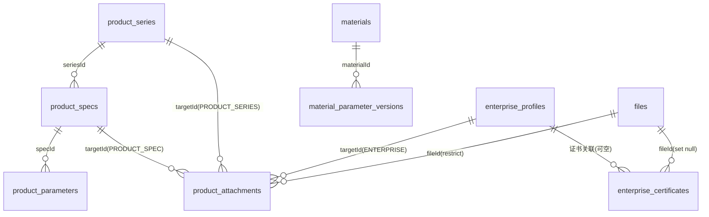
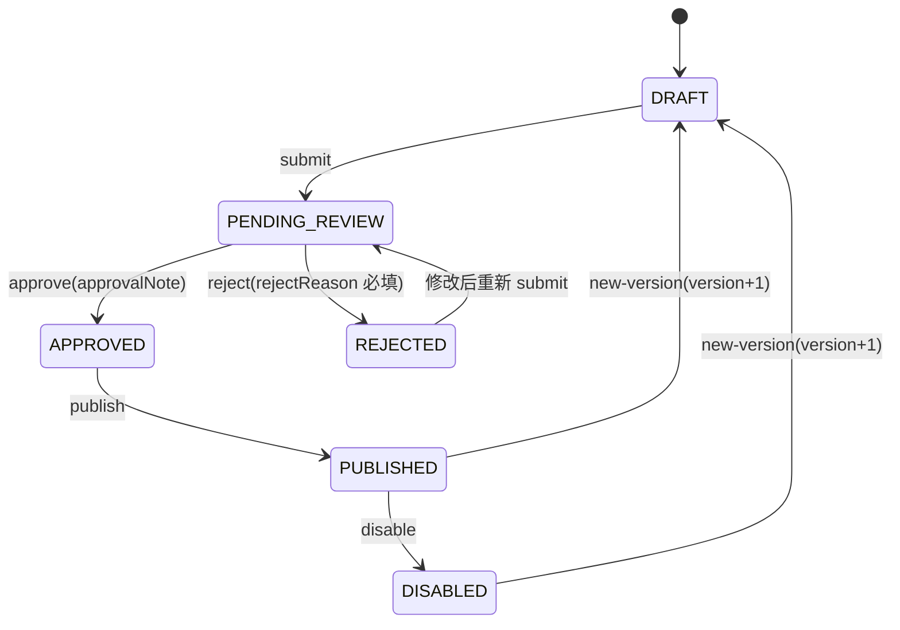

# 主数据（企业 / 产品 / 材料参数）

可配置主数据底座：企业内容与证书、产品系列/规格/性能参数、材料与材料参数版本、附件，全部经过"提交 → 审核 → 发布"状态机后进入**只读的已发布读取服务**，供未来构造方案、热工计算模块确定性取数。知识库负责条文检索/解释/页码引用，结构化库负责产品/系统/构造/热工表/筛选/确定性计算，二者分工不重叠。

## 数据模型（8 张表）



- `enterprise_profiles`：企业内容，同 `code` 多版本行并存，唯一 `(code, version)`。
- `enterprise_certificates`：企业证书，文档引用型（`fileId`），**无版本递增**，编辑就地改。
- `product_series`：产品系列，同 `code` 多版本行并存，唯一 `(code, version)`。
- `product_specs`：产品规格，唯一 `(seriesId, specCode, version)`；`specClass` Ⅰ/Ⅱ/Ⅲ 型，尺寸/燃烧等级等属性应以图集选用表为准（值域待甲方确认）。
- `product_parameters`：产品性能参数，唯一 `(specId, parameterCode, paramSource, version)`；`paramSource` 四来源（TECHNICAL_REGULATION/ATLAS/DETECTION/ENTERPRISE_NOMINAL）同屏并存 = 冲突可见，不默认取最优。
- `product_attachments`：附件，`targetType + targetId` 多态（无 DB 外键，应用层校验目标存在），`fileId` 强引用（restrict，防止误删已归档文件）。
- `materials`：材料，同 `code` 多版本行并存；类别值域待甲方确认。
- `material_parameter_versions`：材料参数版本（导热系数/修正系数/密度/强度/燃烧等级），唯一 `(materialId, version)`，是确定性计算唯一参数来源。

所有专业数据行含通用证据列（`evidence_source`/`evidence_ref` 页码条款/`evidence_level` A/B/C/`effective_at`/`expires_at`）与审核列（四段决议：提交/通过/驳回/发布）。

## 统一状态机



- **版本化实体**（enterprise_profiles / product_series / product_specs / product_parameters / materials / material_parameter_versions）：DRAFT/PENDING_REVIEW/REJECTED 编辑就地改；**编辑已发布数据必须先 new-version**（旧版本保留，历史结果不漂移）；发布时按逻辑键将同键其他 PUBLISHED 行批量 DISABLED，同键无并存已发布版本。
- **非版本化实体**（enterprise_certificates / product_attachments）：仅状态机，编辑就地改。
- 所有状态转换与 `writeAuditLog` 同事务；状态非法抛 `MdError(MD_STATUS_CONFLICT)`。

## 权限码（`system:md:*`）

| 域 | 权限码（list/add/edit/remove/approve/publish） |
| --- | --- |
| 企业内容与证书 | `system:md:enterprise:*` |
| 产品（系列/规格/参数/附件） | `system:md:product:*` |
| 材料与材料参数 | `system:md:material:*` |

种子单一事实源：`src/shared/md-permissions.ts`（`MD_PERMISSIONS` + `MD_PERMISSION_SEEDS`），合并进 `src/db/seed.ts` 幂等写入；`platform_admin` 自动全量。SUPER_ADMIN 直通。

## API（前缀 `/api/v1/platform/masterdata`，标签 `B端 / 平台 / 主数据`）

工作流端点（版本化实体 6 个 / 非版本化实体 5 个）：`POST /{entity}/:id/submit|approve|reject|publish|disable|new-version`，权限：submit=`:add`、approve/reject=`:approve`、publish/disable/new-version=`:publish`。

| 资源 | 端点 |
| --- | --- |
| 企业内容 | `GET/POST /enterprise-profiles`、`GET/PATCH/DELETE /enterprise-profiles/:id` + 工作流 |
| 企业证书 | `GET/POST /enterprise-certificates`、`GET/PATCH/DELETE /enterprise-certificates/:id` + 工作流（无 new-version） |
| 产品系列 | `GET/POST /product-series`、`GET/PATCH/DELETE /product-series/:id` + 工作流 |
| 产品规格 | `GET/POST /product-specs`、`GET/PATCH/DELETE /product-specs/:id` + 工作流 |
| 产品参数 | `GET/POST /product-parameters`、`GET /product-parameters/groups`（按参数分组冲突视图）、`GET/PATCH/DELETE /product-parameters/:id` + 工作流 |
| 附件 | `GET/POST /product-attachments`、`PATCH/DELETE /product-attachments/:id` + 工作流（无 new-version） |
| 材料 | `GET/POST /materials`、`GET/PATCH/DELETE /materials/:id` + 工作流 |
| 材料参数版本 | `GET/POST /material-parameter-versions`、`GET/PATCH/DELETE /material-parameter-versions/:id` + 工作流 |
| 已发布读取 | `GET /published/enterprise-profiles`、`/published/product-specs`、`/published/product-parameters`、`/published/materials`、`/published/material-parameter-versions` |

响应统一 `ok()` 包装 `{success, data, requestId}`；DTO Zod 挂在 `schema.response`（见 `src/modules/masterdata/md.schemas.ts`）；列表分页 `page`（默认 1）/`pageSize`（1-100，默认 20）。

## 已发布读取（计算模块取数入口）

`src/modules/masterdata/md-read.service.ts` 只返回 **PUBLISHED 且 `effective_at <= now <= expires_at`** 的数据；状态过滤在服务内强制，调用方无法传状态参数绕过。`requirePublishedSpecParameters(db, { usage })` 供计算前置使用：无任何已发布且用途允许的参数时抛 `MD_NOT_PUBLISHED`（不吞掉缺失信息）。`usage` 过滤语义：`allowed_usage` 为空数组 = 不限用途，否则必须包含请求用途（用途值域待甲方确认）。

## 导入示例

```bash
pnpm md:import-example
```

`scripts/md-import-example.mjs`：直连 `DATABASE_URL` 插入系列/规格/材料/材料参数/企业内容示例（全部落 DRAFT，按逻辑键幂等跳过），打印各记录 id 与下一步工作流端点。正式批量导入可参照该脚本 + 工作流端点走完审核发布。

## 与知识库 / 未来计算模块的边界

- **知识库**：条文检索、解释、页码引用；**主数据**：产品/系统/构造/热工表/筛选/确定性计算的参数来源。参数读取只走已发布读取服务，不查知识库。
- 多条件输入返回多候选、用户自选不默认最优：体现在 `product_parameters` 四来源并存与 `product-parameters/groups` 冲突视图；图集已有热工结果优先查表属后续构造方案/图集热工结果模块，本期仅提供其取数依赖。
- 本模块不含：构造方案/构造层、图集热工结果、地区标准限值表、整体当量/分层算法、材料对比展示、标准抓取入库（均属后续任务）；不引入向量检索；AI 不参与参数读写。

## 待甲方确认项（当前以可空字段 + 文档标注处理）

1. 证据等级 A/B/C 取值含义。
2. `allowedUsage`（图集查表/整体当量法/分层法）取值与默认值。
3. 燃烧等级取值集合（A1/A2/B1/B2…）。
4. Ⅰ/Ⅱ/Ⅲ 型规格的尺寸/厚度对应表（应以图集选用表为准）。
5. 供应区域值域。
6. 材料强度字段集与单位约定、材料分类值域。
7. 企业简介字段集（logo/地址/联系方式/注册资本等）。
8. 修正系数取值规则与《VICP热工计算表格公式》的对应关系。