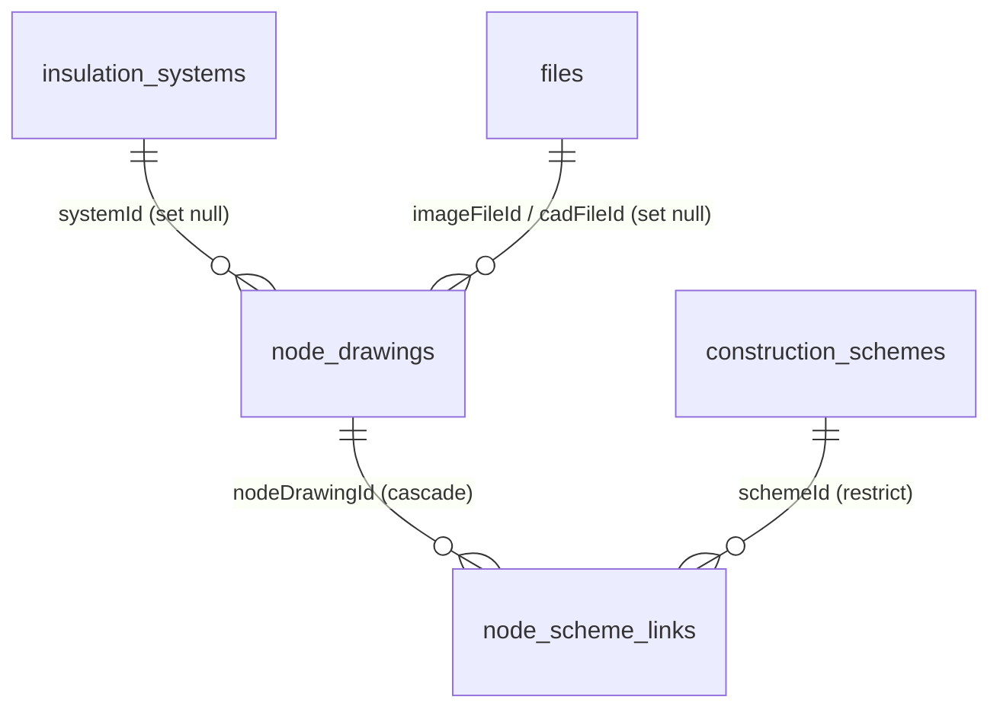

# 节点图库（节点模块）

节点大样图（勒脚/窗台/女儿墙等构造节点）的版本化管理：节点图按保温系统 + 部位组织，可关联多个已发布构造方案，经"提交 → 审核 → 发布"状态机后进入**只读的已发布读取服务**，供报告快照（节点章节）与检索确定性取数。

- 状态机、证据列、审核列、错误码、权限 seed 模式全部复用主数据既有设施（`md-workflow.service.ts`），与构造模块同一套实现，不复制。
- 节点"部位"当前为自由文本 + 精确匹配（待甲方确认标准词汇表后可迁字典）。

## 数据模型（2 张表）

- `node_drawings`：节点图（版本化），唯一 `(code, version)`；`position` 为部位（varchar 80，精确检索）、`systemId` 归属保温系统、`atlasPage` 图集页码、`imageFileId`/`cadFileId` 高清图与 CAD（set null）；含通用证据列与四段审核列。
- `node_scheme_links`：节点-方案关联（随版本复制，无独立审核列），唯一 `(nodeDrawingId, schemeId)`；`schemeId` **restrict**（防误删被引用方案）。

## 状态机与结构校验（复用 masterdata）

- 模块加载时 `registerVersionedEntity("nodeDrawing", ...)` 注册，submit/approve/reject/publish/disable/new-version 与 masterdata 同一套实现。
- **new-version 子表快照**：派生新版本时同一事务内把 `node_scheme_links` 整组复制到新行（`nodeDrawingId` 指向新版本），历史版本子表保留不漂移。
- 子表（关联）无独立工作流：父节点处于 DRAFT/PENDING_REVIEW/REJECTED 时可增删改。
- **submit 与 publish 前强制结构校验**（`collectNodeStructureViolations`，失败抛 `NODE_STRUCTURE_INVALID`，中文违规明细汇总）：
  1. `position` 部位必填；
  2. `imageFileId`/`cadFileId` 至少一个；
  3. 引用保温系统与关联构造方案必须**已发布且生效中**（抛 `NODE_REFERENCE_NOT_PUBLISHED`）。
- 另提供 `POST /nodes/:id/validate` 显式校验：返回 `{ valid, violations }` 不抛错。
- 所有状态转换与 `writeAuditLog` 同事务；审计 targetType 用实体 kind（`node_drawing` / `node_scheme_link`）。

## 权限码（`system:node:*`）

| 动作 | 权限码 |
| --- | --- |
| 查看/新增/修改/删除 | `system:node:{list,add,edit,remove}` |
| 审核/发布 | `system:node:{approve,publish}` |

种子单一事实源：`src/shared/node-permissions.ts`（`NODE_PERMISSIONS` + `NODE_PERMISSION_SEEDS`），合并进 `src/db/seed.ts` 幂等写入；`platform_admin` 自动全量，SUPER_ADMIN 直通。

## API（前缀 `/api/v1/platform/nodes`，标签 `B端 / 平台 / 节点图库`）

| 资源 | 端点 |
| --- | --- |
| 节点图 | `GET/POST /nodes`（列表支持 systemId/position 精确匹配 + keyword 模糊）、`GET/PATCH/DELETE /nodes/:id` + 工作流（submit/approve/reject/publish/disable/new-version）、`POST /nodes/:id/validate` |
| 节点-方案关联 | `GET/POST /nodes/:nodeDrawingId/scheme-links`、`PATCH/DELETE /node-scheme-links/:id` |
| 已发布读取 | `GET /nodes/published`（systemId + position 精确匹配，返回已发布且生效中节点 + 已发布方案关联） |

## 已发布读取（报告快照数据源）

`listPublishedNodesWithLinks`（`node.service.ts`）只返回 **PUBLISHED 且 `effective_at <= now <= expires_at`** 的节点；关联只保留指向**已发布且生效中方案**的链接。状态过滤在服务内强制，调用方无法传状态参数绕过。

## 待甲方确认项

1. 节点"部位"标准词汇表（勒脚/窗台/女儿墙/阴阳角等）——当前自由文本 + 精确匹配，后续可迁字典。
2. 节点高清图/CAD 的格式与分辨率要求——MIME 白名单按常见类型放开（png/jpeg/svg/dwg/dxf）。