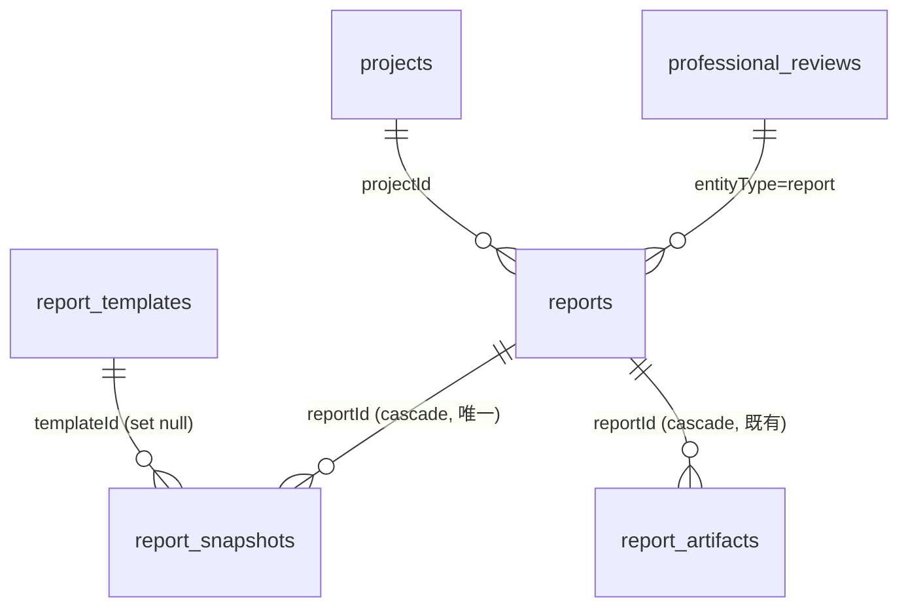
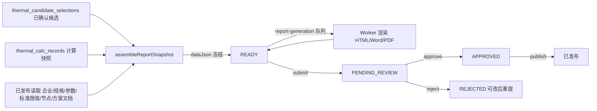

# 报告模板 / 模板报告 / 统一审核中心（报告与审核模块）

模板报告链路：报告模板（章节配置，版本化审核实体）→ 按项目 + 已确认候选生成模板报告 → 快照冻结全部章节数据 → Worker 确定性渲染 → 模板报告强制审核（READY → PENDING_REVIEW → APPROVED）→ 发布。所有专业数据（主数据/构造/热工/标准/比较/节点/报告模板/模板报告）的审核记录统一进 `professional_reviews`，由审核中心队列消费，各域审核端点与审核中心共用同一写入点，无审核分叉。

## 数据模型（新增 3 张表 + reports 审核列）

- `report_templates`：报告模板（版本化审核实体），唯一 `(code, version)`；`sectionsJson` 为章节配置 `[{key,title,enabled,order,sourceType,content?}]`，key 固定枚举（enterprise/project/standards/candidates/selection/thermal/nodes/construction/comparison/acceptance/sources/disclaimer），`sourceType=DATA` 由快照数据确定性渲染、`TEXT` 直接使用配置文案（如免责声明）。
- `report_snapshots`：模板报告数据快照，`reportId` 唯一（cascade）；`dataJson` 整份冻结（projectJson/enterpriseJson/standardsJson/selectionJson/calcJson/nodesJson/acceptanceJson/sourcesJson/disclaimerText），`asOfDate` 为数据生效时点，历史报告完整还原、不随后台参数漂移。
- `professional_reviews`：统一审核记录，每 `(entityType, entityId)` 一行；`entityType` 复用审计 targetType（`md_product_spec`/`construction_scheme`/`thermal_reference_set`/`standard_document`/`node_drawing`/`report_template`/`report` 等），`status` PENDING_REVIEW/APPROVED/REJECTED，`projectId` 为报告审核带项目上下文。
- `reports`：新增 `reportType=TEMPLATE` 与审核列（submitted/approved/rejected 四段决议列 + 备注）；`report_status` 枚举新增 `PENDING_REVIEW/APPROVED/REJECTED`。

## 模板报告数据流（确定性，无 AI 取数）

- **数值只来自已确认候选与计算记录的冻结快照**，不向 AI 索要数值、不重新计算；企业/标准限值/节点/施工验收等静态章节来自 PUBLISHED + 生效中读取，在生成时点冻结。
- 快照组装校验：候选确认记录存在且属于本项目、模板已发布且生效中（失败抛 `REPORT_SELECTION_PROJECT_MISMATCH` / `REPORT_TEMPLATE_NOT_PUBLISHED`）。
- Worker（`report.worker.ts` TEMPLATE 分支）渲染源为 `report_snapshots.dataJson`，纯函数渲染器 `report-template-render.ts`（无 DB、无 AI）：TEXT 章节渲染配置文案，DATA 章节按模板配置输出，缺失数据显式标注"待补充"，不吞错不编造。
- **仅模板报告强制审核**（`template_only`）：`READY → PENDING_REVIEW → APPROVED`（可发布）/ `REJECTED`（可修改后重新提交）；AI 会话报告 publish 保持现状（READY 即可发布）。共用发布端点 `POST /reports/:id/publish` 对 TEMPLATE 强制要求 APPROVED。

## 统一审核中心

- 单一写入点：`md-workflow.service.ts` transition（submit/approve/reject）与 `standard.service.ts` transition 在状态变更**同一事务**内 `upsertProfessionalReview`；报告审核服务同样处理。各域原审核端点与审核中心共用同一记录，无分叉。
- 队列读取 `GET /review-center/queue`（entityType/status 过滤，展示实体中文名 label）；详情 `GET /review-center/queue/:entityType/:entityId`（记录 + 实体数据预览）。
- 决议 `POST /review-center/queue/:entityType/:entityId/approve|reject` 委托各域审核服务执行（状态守卫、事务、审计、统一审核记录由被委托方完成）；委托注册表 `ENTITY_REVIEWERS` 覆盖：主数据六类 + 保温系统/构造方案 + 热工参考集/计算规则/标准限值 + 比较版本 + 节点图 + 报告模板 + 地方标准文档 + 模板报告。
- 审核中心不替代各模块原有审核端点，仅统一队列与决议入口。

## 权限码

| 域 | 权限码 |
| --- | --- |
| 报告模板 | `system:report:template:{list,add,edit,remove,approve,publish}` |
| 模板报告 | `system:report:generate`（生成 + 提交审核 + 查看快照）、`system:report:review`（审核决议） |
| 审核中心 | `system:review:list`（队列/详情）、`system:review:approve`（审核决议） |

种子单一事实源：`src/shared/report-permissions.ts`、`src/shared/review-permissions.ts`，合并进 `src/db/seed.ts` 幂等写入；seed 同时写入默认模板 `standard_report`（章节齐全，免责声明文案待甲方确认）。`platform_admin` 自动全量，SUPER_ADMIN 直通。

## API

| 前缀 | 标签 | 说明 |
| --- | --- | --- |
| `/api/v1/platform/report-templates` | `B端 / 平台 / 报告模板` | 模板 CRUD + 工作流（submit/approve/reject/publish/disable/new-version）+ `POST /:id/validate` 章节校验 |
| `/api/v1/platform/reports` | `B端 / 平台 / 报告中心` | `POST /generate`（快照 + 落库 + 投递队列）、`GET /?projectId=` 列表（TEMPLATE）、`GET /:id/snapshot`、`POST /:id/submit-review`、`POST /:id/approve`、`POST /:id/reject` |
| `/api/v1/platform/review-center` | `B端 / 平台 / 审核中心` | 队列/详情/决议（approve/reject） |

平台路由均要求 `B_ADMIN` + 具体权限码；模板报告的查看/下载仍走项目级 `canViewProject`/`canManageProject`。

## 待甲方确认项

1. 报告免责声明措辞——模板 TEXT 章节初始文案留占位标注，配置可在 B 端调整。
2. "施工验收"章节内容来源——当前取选中方案 `scheme_documents` 已发布知识文档引用生成摘要章节，无资料时标注"待补充"，不编造验收条款。
3. 报告"用户选择"章节仅含 `selectionReason`；是否需要用户自定义补充说明未明确，暂不新增输入。
4. 审核中心范围按任务清单为产品/构造/热工/标准/比较规则/报告（+节点/模板），不包含知识库文档审核（知识库已有独立审核流）。