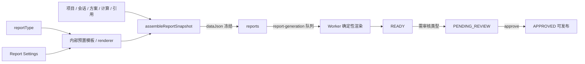

# 报告类型 / 报告设置 / 内部模板 / 审核中心

普通业务模型：**系统预置报告类型 + 报告设置 + 报告生成 + 报告列表**。  
报告模板、章节配置、模板版本与发布是内部渲染配置，不进入普通管理员日常菜单。

## 普通业务流



普通生成入参：

```json
{ "reportType": "technical_scheme", "projectId": null, "conversationId": null }
```

不再要求 `templateId` / `templateVersionId` / `variables` / `sections`。旧接口若仍传 `templateId` 保持兼容。

## 报告类型（系统预置）

| code | name | requiresProject | 内部模板 | 审核 |
| --- | --- | --- | --- | --- |
| `technical_scheme` | 综合技术方案报告 | true | `standard_report` | 是 |
| `project_brief` | 项目方案简报 | true | `project_brief` | 是 |
| `material_compare` | 材料对比报告 | false | `material_compare` | 是 |
| `ai_conversation` | AI对话整理报告 | false | 无（contentJson） | 否 |

`GET /types` 只返回 `{ code, name, description, requiresProject, enabled }`，不暴露 templateVersionId / renderer / variable schema。  
历史 `TEMPLATE` / `energy_design` / `design_note` / `marketing_copy` 仍可生成、查看、导出，但不出现在普通类型列表。

## 报告设置

全局单行 `report_settings`（key=`default`）：

- `defaultReportType` / `coverTitle` / `showCalculationProcess` / `showSourceReferences` / `showDisclaimer`
- `disclaimerText` / `headerText` / `footerText` / `defaultExportFormat`（PDF | DOCX）
- `companyLogoFileId` **只读派生**，优先来自 CompanyProfile（`docs/company/README.md`），不重复存储；报告设置不再维护第二套企业名称/Logo

设置在生成时点冻结进 `report_snapshots.dataJson.settings`，历史报告不随后台修改漂移。

## 内部模板（保留，降级）

`report_templates` / `report_snapshots` 不删除。模板仍是版本化实体，供 Worker 按章节渲染。  
`/api/v1/platform/report-templates` 保留给 SUPER_ADMIN / 持有 `system:report:template:*` 的高级技术管理员；菜单 `/reports/templates` 为隐藏路由。

## 审核

审核对象是**生成后的 Report**，不是模板发布。  
`reportTypeRequiresReview` 为 true 的类型（预置模板类 + 历史 TEMPLATE）：READY → PENDING_REVIEW → APPROVED 可发布 / REJECTED 可重提。  
AI 会话类报告 READY 即可发布。

## 权限码

| 域 | 权限码 |
| --- | --- |
| 报告列表/生成 | `system:report:generate` |
| 报告审核 | `system:report:review` |
| 报告设置 | `system:report:settings` |
| 内部模板 | `system:report:template:{list,add,edit,remove,approve,publish}`（隐藏菜单） |
| 审核中心 | `system:review:{list,approve}` |

## API

| 前缀 | 说明 |
| --- | --- |
| `GET /api/v1/reports/types` | 登录用户可读预置类型 |
| `POST /api/v1/reports` | 普通生成：`reportType` + 可选 `projectId`/`conversationId`；兼容 `contentJson`/`sourceMessageIds` |
| `GET/PUT /api/v1/platform/reports/settings` | 全局报告设置 |
| `GET /api/v1/platform/reports/types` | B 端预置类型 |
| `POST /api/v1/platform/reports/generate` | B 端生成；`templateId`/`selectionId` 可选兼容 |
| `/api/v1/platform/report-templates` | 内部模板 CRUD + 工作流（兼容保留） |

## 兼容历史报告

- 历史 `reportType=TEMPLATE` 仍按快照渲染、审核、下载
- 旧 `templateId`/`templateVersion` 仍写在 `report_snapshots`
- Worker：有快照走模板渲染器，无快照走 contentJson（历史 AI 报告）
