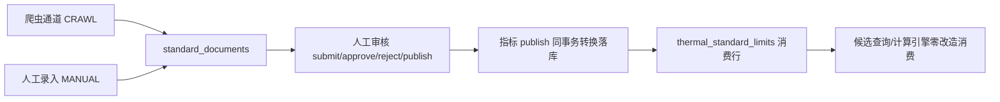

# 地方标准采集（standard 模块）

全国省份标准网站定时抓取 + 人工录入双通道，人工审核通过后转换落库消费模型（`thermal_standard_limits`），参与热工候选查询的合格判定。**待审核/草稿数据任何消费通道不可见**。

## 双通道数据流

- **爬虫通道（CRAWL）**：`standard_sources` 配置站点 → `crawl_jobs` 记录作业（BullMQ `maintenance` 队列 `standard_crawl` 任务，cron_jobs 定时触发或 `POST /sources/:id/crawl` 手动触发）→ 列表页解析（url 翻页/scroll 渲染/none 三种分页模式）→ 详情页原文 HTML + PDF 附件存对象存储（SHA-256 幂等与变更检测）→ 提取规则产出文档行（DRAFT）+ 指标行（PENDING_REVIEW）。
- **人工通道（MANUAL）**：`POST /documents` 组合提交（文档 + 适用范围[] + 指标[]），文档默认 DRAFT、指标默认 PENDING_REVIEW；**每条指标证据条款引用（evidenceRef）必填**，不填不得提交。
- **汇合**：两通道进同一 `standard_documents` 身份空间（唯一键 `(province_code, document_no, version)`），省份是主维度（文档行冗余 `province_code`）。同 `(provinceCode, documentNo)` 已存在时人工录入被拒，提示核对编号或关联版本。
- **发布转换**：指标 publish 同事务生成 `thermal_standard_limits` 行（basisCode=documentNo、basisName=title、clauseRef=evidenceRef、limitKValue=value、生效窗=文档生效窗、`standard_document_id` 溯源）。同 `(regionCode, basisCode)` 旧 PUBLISHED 行自动 DISABLED（版本互斥）；同地区不同 basisCode 天然并存。

## 抓取配置（B 端可配置，通用解析器不写死站点代码）

| 配置项 | 说明 |
| --- | --- |
| `provinceCode/Name` | GB/T 2260 省级行政区划码（主维度） |
| `officialDomain` | 站点官方域名，唯一 `(provinceCode, officialDomain)` |
| `catalogUrls[]` | 栏目：`{label, url, listSelector?, itemLinkSelector?, paginationMode: url\|scroll\|none, pageParam?, pageLimit?}` |
| `extractRules[]` | 提取规则：`{field, pattern, flags?}`（documentNo/标题/发布实施日期/标准状态/指标值等），基于已存原文运行 |
| `keywords` | `{titleKeywords[], excludeKeywords[]}` 列表项标题关键字过滤 |
| `crawlScope` | `today`（只处理当天发布项）/ `all`（全量分页），手动触发可临时覆盖 |
| `enabled` | 与 cron_jobs 双保险（停用后不抓，需先停用才能删除来源） |

- **先存原文、后提取**：详情页原始 HTML 存对象存储（`pageHtmlObjectKey` + SHA-256），提取规则基于已存原文运行（`parsedMetaJson` 保留原文片段）。网页变更可审计（同 URL 新哈希 → CHANGED 新版本行）、规则调整后可重跑提取不重抓网页、人工复核可对照原文。
- **异常处理**：crawl_jobs 状态机 QUEUED/RUNNING/SUCCESS/FAILED + `errorMessage` + `catalogResults`（栏目级统计）；单栏目失败不中断整体（记录后继续），全部失败才 FAILED；sha256 幂等保证中断重跑不重复入库。

## 审核语义（轻量流转，不挂 masterdata 工作流）

三张表共用同套流转：`DRAFT → PENDING_REVIEW → APPROVED → PUBLISHED → DISABLED`，PENDING_REVIEW 可驳回为 REJECTED（REJECTED 可改后重新提交）。

- 文档/适用范围/指标各自独立流转；**指标发布前置校验**：文档 PUBLISHED + 指标所属适用范围 PUBLISHED，不满足拒绝发布。
- 文档 publish 同事务将同 `(provinceCode, documentNo)` 其他 PUBLISHED 行置 DISABLED。
- 第一版仅 K_VALUE 指标转换落库；HEAT_RESISTANCE/OTHER 正常审核流转但不生成限值行。

## 版本替代与过渡期

- `standard_replacements`：`oldDocumentId → newDocumentId`，类型 SUPERSEDE/REPEAL，状态 PENDING/CONFIRMED/REJECTED。
- **confirm 同事务**：替代关系 CONFIRMED + 旧文档 `expiresAt = transitionEndAt`（未填则立即失效）；过渡期内新旧标准在消费侧并存。
- **每日扫描**（抓取 job 顺带执行 `expireSupersededDocuments`）：`expiresAt` 已过的 PUBLISHED 文档 → DISABLED，消费限值随生效窗自然过期。

## 与 AI 对话集成

AI 对话**不直接读抓取库**。链路：抓取/人工录入 → 人工审核 → 指标发布转换落库 `thermal_standard_limits` → AI 端既有工具（`/api/v1/ai/thermal/candidates`、`/calc`）只消费已发布且生效中的限值。对话中问地区限值：

- 单标准 → 沿用既有行为（`limit` 生效，`targetK` 缺省取 limitKValue）。
- **多标准并存** → 返回 `limitCandidates` 全部候选 + notes「多标准并存请选择」，`targetK` 未显式给时 K 条件标缺失（不隐式选最严格）；用户确认后以 `standardLimitId` 继续计算。
- `asOfDate` 可选：限值生效窗按项目时点判定（历史项目查询）。

标准原文 PDF 推送知识库条文检索列为后续迭代（待确认）。

## API（前缀 `/api/v1/platform/standard`，标签 `B端 / 平台 / 标准采集`）

| 端点 | 说明 | 权限 |
| --- | --- | --- |
| `GET/POST /sources`、`GET/PATCH/DELETE /sources/:id` | 抓取来源配置 | `system:standard:list/add/edit/remove` |
| `POST /sources/:id/crawl` | 手动触发抓取（body 可带 scope 覆盖） | `system:standard:run` |
| `GET /crawl-jobs`、`GET /crawl-jobs/:id` | 抓取作业历史/详情（失败重跑） | `system:standard:list` |
| `GET /documents` | 文档列表（省份/编号/状态/审核态/**ingestType** 筛选） | `system:standard:list` |
| `POST /documents` | **人工录入 MANUAL**（组合提交，证据必填） | `system:standard:add` |
| `GET/PATCH/DELETE /documents/:id` | 详情（含适用范围与指标）/修改/删除（仅 DRAFT） | `system:standard:list/edit/remove` |
| `POST /documents/:id/{submit\|approve\|reject\|publish}` | 文档审核流转 | `system:standard:approve/publish` |
| `GET /documents/:id/{file-url\|html-url\|screenshot-url}` | 原文/附件/截图下载地址（对象存储预签名） | `system:standard:list` |
| `GET/POST /applicability`、`PATCH/DELETE /applicability/:id` + 审核流转 | 适用范围维护 | `system:standard:*` |
| `GET /indicators`（默认待审核队列）、`GET/PATCH/DELETE /indicators/:id` + 审核流转 | 指标维护与人工修正（数值/证据引用） | `system:standard:*` |
| `POST /indicators/:id/publish` | **指标发布 → 同事务转换落库 thermal_standard_limits** | `system:standard:publish` |
| `GET/POST /replacements`、`DELETE /replacements/:id`、`POST /replacements/:id/{confirm\|reject}` | 版本替代与过渡期 | `system:standard:*` |
| `GET /standards/effective?regionCode=&asOfDate=` | 指定地区指定时点已发布生效标准（时间线） | `system:standard:list` |
| `GET /published/indicators?regionCode=` | 已发布指标确定性取数 | `system:standard:list` |

权限码定义见 `src/shared/standard-permissions.ts`（`system:standard:{list|add|edit|remove|approve|publish|run}`），种子随 `src/db/seed.ts` 展开。错误码见 `src/shared/standard-errors.ts`（STANDARD_*）。

## 测试

`src/modules/standard/` 下 3 个测试文件：

- `standard.schemas.test.ts`：body/DTO Zod 规则（MANUAL 组合提交、证据必填 refine、双通道枚举、分页模式、替代关系 uuid）；
- `standard-crawl.test.ts`：提取规则（编号/日期/状态）、关键字过滤、分页 URL 构造、哈希幂等、变更检测、today/all 范围；
- `standard.service.test.ts`（drizzle 桩）：人工录入组合提交与重复检测、审核流转守卫、指标 publish → thermal_standard_limits 同事务转换（旧版 DISABLED/version 递增/溯源）、非 K_VALUE 不落库、替代确认过渡期、每日过期扫描。

## 待甲方确认项

1. 目标省份站点清单（域名/栏目 URL/列表页结构/分页方式）——通用解析器需要真实站点验证，第一版用启发式默认值。
2. 「导入」是否指 Excel 批量导入：第一版只做 B 端表单单条录入；Excel 批量导入是否纳入后续迭代。
3. 指标提取来源：第一版从详情页 HTML 文本确定性提取；PDF 全文解析是否纳入后续迭代。
4. 截图范围：详情页（已实现）；列表页/PDF 原文页是否也要截。
5. 过渡期结束触发：每日抓取 job 顺带扫描（已实现）；是否需独立定时任务。
6. 计算引擎 `/calc` 多标准并存时是否也要候选确认（第一版不改）。
7. 标准原文是否推送知识库供 AI 条文检索（后续迭代）。
8. 手动录入与抓取通道同 `(regionCode, basisCode)` 并存冲突策略（当前同键新发布自动停用旧版，以最后发布为准）。

## 抓取源运营补强（2026-08）

- `standard_sources` / `knowledge_crawler_sources` 新增运营回写字段：`last_crawled_at`、`last_crawl_status`（SUCCESS/FAILED）、`last_crawl_summary`（标准源，统计 JSON）、`last_error_message`、`operator_remark`（人工备注，B 端 PATCH 维护）。
- 回写时机：`runStandardCrawl` 收尾（按作业 SUCCESS/FAILED 与失败统计）、`runCrawlerSource` 成功/异常路径（异常截断 500 字）。
- 不新建 crawler engine，仅补齐"来源收集"运营能力。
