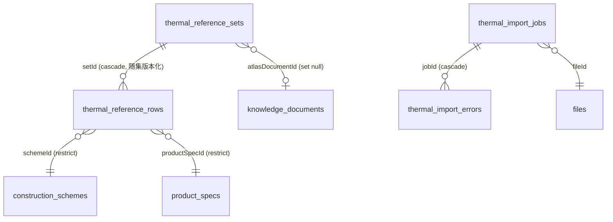

# 图集热工参考选用表（thermal 模块）

图集热工参考选用表（如"外墙外保温系统构造选用表"，列出不同保温厚度的 **K 值 / 产品层热阻 / 总热阻**）的 Excel 导入、版本化审核与已发布读取。一期方案筛选的第一优先数据源，为未来"地区标准限值 → 候选方案"筛选提供确定性 K 值查表。

- 结构化库分工：**知识库**负责图集条文检索/解释/页码引用；**主数据**负责产品/规格；**构造模块**负责保温系统/构造方案/构造层/产品选项组合；本模块承接**图集热工结果表**的导入、审核、版本化管理与已发布查表。
- 独立模块（不并入 masterdata），但状态机、证据列、审核列、权限 seed、错误模板全部复用既有设施。

## 数据模型（4 张表 + 2 枚举变更）



- `thermal_reference_sets`：参考集（版本化），同 `code` 多版本行并存，唯一 `(code, version)`；`atlasDocumentId` 可空绑定知识库图集文档；含证据列/审核列/生效区间。
- `thermal_reference_rows`：参考行（随集版本化，无独立审核列，状态由集承载），键 `(schemeId, productSpecId, thicknessMm)`；`schemeId`/`productSpecId` **restrict**（防误删被引用数据）；同时保存**原始值** `raw_thickness`/`raw_product_resistance`/`raw_total_resistance`/`raw_k_value`（Excel 原样文本，禁止 AI/OCR 改写后直接发布）与标准化数值；`evidence_source`/`evidence_ref`（页码）必填，`evidence_level` 导入行默认 `A`（图集原文）。
- `thermal_import_jobs`：导入作业（`setCode` 为 apply 目标集编码），状态机 `CREATED → QUEUED → PARSING → PARSED → APPLIED/FAILED`；`result`（jsonb）为解析后有效行快照；失败写 `errorMessage`。
- `thermal_import_errors`：错误行（随作业级联），含 `sheetName`/`rowNumber`/`rawRow` 快照/`errorType`/中文 `message`。

枚举：`knowledge_file_source` 增 `THERMAL_IMPORT`；新增 `thermal_import_job_status`。

## 导入流程（预签名直传 + BullMQ 解析）


- **模板**：`GET /thermal/import-template`（xlsx 下载）或 `pnpm thermal:template` 本地生成 `thermal-import-template.xlsx`；8 列固定：`构造编号 | 产品规格 | 厚度 | 产品层热阻 | 总热阻 | K值 | 来源文档 | 页码`，表头精确匹配，说明页（sheet 名含"说明"）自动跳过。
- **解析匹配**（`thermal-import.service.ts`，纯函数 + 注入已发布查询，全走已发布取数、禁止读草稿）：
  - 构造编号 → 已发布生效方案 `schemeCode` 精确匹配（未命中 `UNKNOWN_SCHEME`）；
  - 产品规格 → 方案产品选项集合内 `specCode` 精确匹配（未命中 `UNKNOWN_SPEC`）；
  - 厚度必须落在该规格 option 的 `[minThickness, maxThickness]`（否则 `OUT_OF_RANGE`）；
  - 数值解析失败 `PARSE_ERROR`、证据缺失 `MISSING_EVIDENCE`、文件内重复键 `DUPLICATE_IN_FILE`（仅保留首行）。
- **apply 事务应用**（`thermal.service.ts`，单事务全有或全无）：
  - 错误行**默认拒绝**（body `ignoreErrors: true` 显式确认才跳过，绝不静默）；
  - 目标集：`setCode` 有最新 DRAFT/REJECTED 集则复用，无则创建 DRAFT v1，最新非 DRAFT 拒绝（提示先 new-version 派生草稿）；
  - diff 键 `(schemeId, productSpecId, thicknessMm)`：added 插入 / changed 更新 / removed 仅响应提示**不删除**；
  - DB 唯一冲突（23505）整体回滚并写 `APPLY_CONFLICT` 错误行。

## 统一状态机（复用 masterdata `md-workflow.service.ts`）

与构造模块一致：`DRAFT → PENDING_REVIEW → APPROVED → PUBLISHED`，`REJECTED` 可修正重提，`PUBLISHED/DISABLED → new-version` 派生新草稿并**同事务复制全部参考行**（历史版本快照不漂移）。`registerVersionedEntity("thermalReferenceSet", ...)` 注册；submir/publish 前强制结构校验（`validateThermalSet`）：

1. 集非空（至少 1 行参考行）；
2. 行引用方案必须**已发布且生效中**（禁止引用草稿/失效）；
3. 引用的产品规格必须在方案产品选项内；
4. 厚度落在选项 `[minThickness, maxThickness]`；
5. 数值（产品层热阻/总热阻/K 值）> 0；
6. 来源文档与页码必填；`effectiveAt <= expiresAt`。

另提供 `POST /sets/:id/validate` 显式校验返回 `{valid, violations}` 不抛错。子表（参考行）无独立工作流：集处于 DRAFT/PENDING_REVIEW/REJECTED 时可增删改，其余状态拒绝。

## 权限码（`system:thermal:*`）

| 域 | 权限码 |
| --- | --- |
| 图集热工参考表 | `system:thermal:{list,add,edit,remove,approve,publish,import}` |

种子单一事实源：`src/shared/thermal-permissions.ts`（`THERMAL_PERMISSIONS` + `THERMAL_PERMISSION_SEEDS`），合并进 `src/db/seed.ts` 幂等写入；B 端菜单挂载见 `docs/menus/README.md`（"图集热工表"叶子 routePath `/thermal/sets` 挂产品中心 / 热工数据，"标准限值" `/thermal/standard-limits` 挂知识中心 / 标准规范，"计算记录" `/thermal/calc-records` 为隐藏路由，permissionCode 均为 `system:thermal:*`）。SUPER_ADMIN 直通。

## API（前缀 `/api/v1/platform/thermal`，标签 `图集热工参考表`）

| 资源 | 端点 | 权限码 |
| --- | --- | --- |
| 参考集 | `GET/POST /sets`、`GET/PATCH/DELETE /sets/:id` + submit/approve/reject/publish/disable/new-version + `POST /sets/:id/validate` | list/add/edit/approve/publish |
| 参考行 | `GET/POST /sets/:setId/rows`、`PATCH/DELETE /rows/:id`（随集状态守卫） | list/edit |
| 导入 | `GET /import-template`、`POST /import-jobs`、`POST /import-jobs/:id/complete`、`GET /import-jobs`（分页）、`GET /import-jobs/:id`（含错误清单）、`GET /import-jobs/:id/preview`、`GET /import-jobs/:id/diff`、`POST /import-jobs/:id/apply` | import |
| 已发布读取 | `GET /published/sets`、`GET /published/sets/:id`（含行，供未来筛选模块） | list |

响应统一 `ok()` 包装 `{success, data, requestId}`；DTO Zod 见 `src/modules/thermal/thermal.schemas.ts`。错误码：`THERMAL_ENTITY_NOT_FOUND`(404)、`THERMAL_STATUS_CONFLICT`(409)、`THERMAL_DUPLICATE_KEY`(409)、`THERMAL_IMPORT_INVALID`(400)、`THERMAL_STRUCTURE_INVALID`(400)、`THERMAL_SET_VERSION_CONFLICT`(409)、`THERMAL_REFERENCE_NOT_PUBLISHED`(409)。

## 已发布读取（计算模块取数入口）

`thermal-read.service.ts` 只返回 **PUBLISHED 且 `effective_at <= now <= expires_at`** 的参考集；详情聚合参考行。状态过滤服务内强制，调用方无法传状态绕过。未来"地区标准限值（如 75% 节能 K 值限值）→ 候选方案"筛选以本接口为 K 值来源。

## 确定性热工计算引擎（三模式）

```mermaid
flowchart LR
    A[POST /calc 入参: mode/schemeId/productSpecId/thicknessMm] --> B[已发布取数: 方案+选项+规则+限值+参数]
    B --> C{mode}
    C -- REFERENCE_TABLE --> D[查已发布图集行 (scheme, spec, 厚度) 精确匹配]
    C -- EQUIVALENT --> E[产品层 R = δ / (λ当量 × a) + 其余层并入]
    C -- LAYERED --> F[逐层 R = δ / (λ × a) 汇总 + 表面换热阻]
    D --> G[结果 + 全过程快照单事务落库 + 审计]
    E --> G
    F --> G
```

- **数据流**：保温系统 → 构造方案 → 构造层 → 产品规格 → 图集热工结果（REFERENCE_TABLE）/ 计算规则+材料与产品参数（EQUIVALENT/LAYERED）→ 地区标准限值 → 候选方案。构造层数/材料/厚度随系统产品而异，优先以图集节能计算参考选用表为准（查不到精确行时提示改用计算模式，**禁止插值**）。
- **确定性原则**：调用方只能传 `{mode, schemeId, productSpecId, thicknessMm, regionCode?, ruleCode?}`，任何数值参数（λ/修正系数/限值）都从 **PUBLISHED 且生效中**的数据加载；中间过程不取整，仅最终 K/总热阻按规则 `precision` + `roundingMode`（HALF_UP/HALF_EVEN/TRUNCATE/NONE）取整展示；判定基于取整后的展示值。同输入两次计算完全相等（`thermal-regression.test.ts` 强制断言）。
- **公式族**（`thermal_calc_rules.formula_version` 标识，当前 `VICP-CALC-1`，通用口径待甲方核对《VICP 热工计算表格公式》）：每层 `R = δ(m) / (λ × 修正系数)`；EQUIVALENT 产品层 `R = 总厚 / (λ当量 × a)`，其余层按 `includeNonProductLayers` 并入；`R_total = ΣR + R_i + R_e`（按 `includeSurfaceResistances`）；`K = 1 / R_total`；合格判定按 `compareField`（K_VALUE/TOTAL_RESISTANCE）+ `compareOperator`（LTE/GTE）与限值比较。
- **规则与标准限值**（`thermal_calc_rules` / `thermal_standard_limits`，版本化实体复用 masterdata 状态机 + 证据/生效区间列）：规则配置表面换热阻/精度/取整/判定/参数码映射（`parameterCodes` + `paramSourcePriority` + `usage`，杜绝硬编码参数码）；标准限值按 `(regionCode, basisCode)` 多版本并存，只取已发布且生效中。EQUIVALENT/LAYERED 无已发布规则直接拒绝（字段级错误）；无已发布限值不阻断计算（`compliant: null` + notes 提示）。
- **快照语义**（`thermal_calc_records`）：入参/构造层/参数（id+version+来源）/规则/标准/公式表达式/中间步骤全部 jsonb 落库，历史结果不随后台参数漂移；记录详情按"本人/SUPER_ADMIN/项目可见"放行。
- **失败语义**：输入校验失败返回 `{valid: false, errors: [{field, code, message}]}`（HTTP 200 + `ok()` 包装），不抛业务异常、不吞来源/版本/适用条件/错误信息；落库与审计同事务，校验失败不落库（未发生计算）。

## API（计算引擎）

| 端点 | 说明 | 权限 |
| --- | --- | --- |
| `POST /api/v1/platform/thermal/calc` | 执行计算（三模式），返回 `{valid, errors, notes, record}` | `system:thermal:list` |
| `GET /api/v1/platform/thermal/calc-records`、`/calc-records/:id` | 计算记录分页/详情（快照可追溯） | `system:thermal:list` |
| `POST /api/v1/ai/thermal/calc` | AI 端执行计算（PC AI端 / 热工计算 标签）：body 必填 `projectId`，C_APP/PC_AI 客户端守卫 + `canViewProject` 项目可见性 | 登录（C 端/AI 端） |
| `GET/POST /calc-rules`、`GET/PATCH/DELETE /calc-rules/:id` + submit/approve/reject/publish/disable/new-version + `POST /calc-rules/:id/validate` | 计算规则 CRUD + 版本化工作流 | `system:thermal:{list,add,edit,remove,approve,publish}` |
| `GET/POST /standard-limits`、`GET/PATCH/DELETE /standard-limits/:id` + 工作流 + `POST /standard-limits/:id/validate` | 地区标准限值 CRUD + 版本化工作流 | 同上 |

## 目标 K 值最接近优先排序

提供 targetK 时，同匹配级别内按 targetK-kValue 升序（最接近目标优先）；候选附 ranking.kGap/isClosestToTarget。

## 候选方案查询与确认


- **查询语义**（`thermal-candidate-matcher.ts` 纯函数 + `thermal-candidate.service.ts`）：
  - 条件三态：命中 / 未命中 / 数据缺失（如方案未填基层厚度、集未配置建筑类型）。缺失不排除候选，仅标注；`globalMissingConditions` 汇总全量缺失维度——条件不完整时返回宽泛候选，**不伪造精确结论**。
  - 地区（`regionCode`/`standardLimitId`）是**合格判定维度**不是行过滤维度：解析为 `limitKValue`（`targetK` 缺省值），候选附 `compliant`（`kValue <= limitKValue`，无限值时为 `null`）。
  - **多标准并存**（地方标准采集发布后同地区多份标准天然并存）：`regionCode` 未带 `standardLimitId` 时解析该地区全部 PUBLISHED 且生效中的限值——1 份沿用既有行为（`limit` 生效）；多份时 `limit=null`、`limitCandidates` 返回全部候选（basisCode/版本/K 值），notes 提示「多标准并存请选择」，`targetK` 未显式给时 `missingConditions` 标 `targetK`（**不隐式选最严格**）；用户确认标准后再以 `standardLimitId` 查询。
  - **项目日期**：`asOfDate` 可选（ISO 日期），限值生效窗（`effective_at`/`expires_at`）按该时点判定，缺省当前时间——用于查询历史项目时点的标准约束。
  - 基层材料忽略空白/大小写**双向包含匹配**（「200mm钢筋混凝土」可命中「钢筋混凝土」）；基层厚度 ±0.5mm 相等匹配。
  - **相邻规格**：精确厚度查询无该档时，同 (集,方案,规格) 组内返回最近档（`neighborTolerance` 档数内，默认 1，0 禁止），标注 `matchType=NEIGHBOR` + `neighborGap`；相邻档同样受其余条件约束。区间查询不产生相邻规格。
  - **排序只按后台规则**：命中条件数降序 → 标准厚度升序 → 集 `priority`（甲方配置优先级，小优先）→ 集版本降序；**不宣称唯一最优**。
- **计算后备**：第一版只做图集查表（`calculationSource=REFERENCE_TABLE`）；图集无结果返回空候选 + 提示（相邻容差/调整条件），**不自动批量计算**。待确认后按业务规则 5 接已审核计算规则。
- **数据支撑**（参考集/行 + 方案/系统/规格全部只读 **PUBLISHED 且生效中**）：`thermal_reference_sets` 新增 `building_types`（适用建筑类型数组）与 `priority`（甲方配置优先级）列；行 join 方案/系统/规格取基层/图集页码/规格分类。
- **确认快照**（`thermal_candidate_selections`，迁移 0019）：保存查询条件（`queryJson`）+ 用户确认的最终候选全快照（`candidateJson`：行/集/方案/规格版本、K/热阻、证据、matchType）+ 选择理由 + 操作人；写入前校验候选行属于已发布且生效中的参考集（禁止确认草稿/待审核数据），落库与审计同事务。

## API（候选方案查询与确认）

| 端点 | 说明 | 权限 |
| --- | --- | --- |
| `POST /api/v1/platform/thermal/candidates/query` | 候选方案查询（条件匹配图集参考行，返回候选列表+命中/未命中/缺失+来源页码+适用条件） | `system:thermal:list` |
| `GET /api/v1/platform/thermal/candidate-selections` | 候选确认记录分页（快照可追溯） | `system:thermal:list` |
| `POST /api/v1/ai/thermal/candidates` | AI 端候选查询：body 必填 `projectId`，C_APP/PC_AI 守卫 + `canViewProject` | 登录（C 端/AI 端） |
| `POST /api/v1/ai/thermal/candidate-selections` | AI 端保存用户确认的最终候选与选择理由 | 登录（C 端/AI 端） |


## 测试

`src/modules/thermal/` 下 4 个测试文件（drizzle 链式桩直接调服务，参照 `construction-workflow.test.ts`）：

- `thermal-import.test.ts`：内存 workbook 解析、表头校验、错误分类、重复键、模板可重新解析；
- `thermal-apply.test.ts`：新建/复用 DRAFT 集、不同值更新、removed 不删除、状态拒绝、ignoreErrors 语义、唯一冲突整体回滚；
- `thermal-workflow.test.ts`：new-version 复制参考行、状态守卫、结构校验违规分类；
- `thermal.schemas.test.ts`：body/DTO Zod 规则（正数、raw 必填、日期转换、mime 白名单）；
- `thermal-calculator.test.ts`：三模式公式、四种取整、合格判定、字段级错误、确定性（同输入两次相等）；
- `thermal-calc.service.test.ts`：已发布取数、厚度区间校验、未发布规则拒绝、无限值 compliant=null、当量参数优先级、REFERENCE_TABLE 精确匹配/无匹配提示、快照落库与审计；
- `thermal-candidate-matcher.test.ts`：验收 1（200mm 钢筋混凝土 + Ⅰ型 + K≤0.25 → 25mm+ 行）、验收 2（条件不完整 → 缺失标注+宽泛候选）、验收 3（无 22mm 档 → 相邻已发布规格/空结果）、条件三态、排序规则；
- `thermal-candidate.service.test.ts`：已发布集取数、限值解析与 compliant、未发布限值拒绝、确认快照落库 + 审计同事务、候选不在已发布集拒绝、项目可见性、分页；
- `thermal-regression.test.ts`：读取 `fixtures/thermal-regression/*.json`（输入+期望结果）驱动 calculator 断言并强制确定性；当前为内置最小自检样例，甲方样例到位后直接放入该目录即可。

## 待甲方确认项

1. 模板列口径：构造编号是否即 `schemeCode`（如 A1-1）、规格列是编码还是名称、厚度/数值是否带单位文本、总热阻是否含基层及空气层。
2. 真实图集选用表 Excel/截图（当前无源文件，模板按通用 8 列设计，行数据待提供）。
3. 参考集粒度：一本图集一个集（按页码分组行）还是按页码分多个集。
4. 重复导入语义：added/changed 应用、removed 仅提示不删除是否可接受。
5. 证据等级口径：导入行默认 `A`（图集原文）是否可接受。
6. 集 `code` 命名规范（如 `ATLAS-2026-VICP`）由谁定义。
7. 《VICP热工计算表格公式》公式原文未提供——EQUIVALENT/LAYERED 按通用口径（GB 50176 体系：`R=δ/(λ×修正系数)`、`K=1/总热阻`）实现（`formula_version=VICP-CALC-1`），待资料核对。
8. 内外表面换热阻默认取值（如 R_i=0.11、R_e=0.04 m²·K/W）是否按 GB 50176（当前由已发布规则配置）。
9. 修正系数用法（乘在导热系数上 `λc=λ×a`）确认。
10. `product_parameters` 多来源优先级 `paramSourcePriority` 值域（当前配置数组，空=取最新版本）。
11. 标准限值 `regionCode` 编码规范（行政区划码或自定义）。
12. 甲方回归样例数据（输入+期望结果，`fixtures/thermal-regression/`）。
13. `allowedUsage` 用途值域（如 `THERMAL_CALC`）。
14. 候选查询「建筑类型」：当前按参考集 `building_types` 文本数组包含匹配，图集原文如何标注适用建筑类型待核对。
15. 相邻规格默认容差档数（实现默认 1 档、可配 0-3）与「相邻」定义待甲方确认。
16. 排序中「标准厚度」的解释（实现取厚度升序 = 达标的最小标准厚度优先；甲方是否要求默认厚度优先待核对）。
17. 基层厚度匹配容差（实现 ±0.5mm；验收样例 200mm 的写法规格待核对）。
18. 选择理由是否报审必填（当前可选）。
19. 候选确认记录是否必须绑定项目（当前可选，set null 保留）。
20. 图集无结果时的计算后备粒度：候选查询是属性级模糊条件，无法直接复用 `executeThermalCalc`（需具体方案/规格/厚度三元组），第一版不自动批量计算，待甲方确认触发方式。